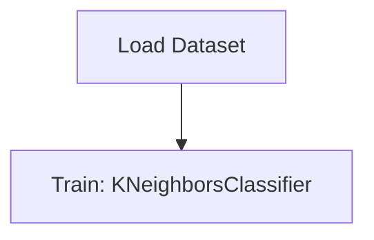

# Advanced Credit Card fraud Detection

## 1. Project Overview

This project implements a **Classification** pipeline for **Advanced Credit Card fraud Detection**. The target variable is `Class`.

| Property | Value |
|----------|-------|
| **ML Task** | Classification |
| **Target Variable** | `Class` |
| **Dataset Status** | BLOCKED MISSING |

## 2. Dataset

> ⚠️ **Dataset not available locally.** creditcard.csv (Kaggle: credit card fraud detection)

## 3. Pipeline Overview

### Original Notebook Pipeline

**Models trained:**
- KNeighborsClassifier

## 4. ML Workflow



## 5. Notebook Summary

| Metric | Value |
|--------|-------|
| Total cells | 25 |
| Code cells | 22 |
| Markdown cells | 3 |
| Original models | KNeighborsClassifier |

## 6. Model Details

### Original Models

- `KNeighborsClassifier`

## 7. Project Structure

```
Advanced Credit Card fraud Detection/
├── Handling_Imbalanced_Data-Under_Sampling.ipynb
└── README.md
```

## 8. Setup & Installation

`pip install -r requirements.txt` from the workspace root.

**Key dependencies:**

- `imbalanced-learn`
- `matplotlib`
- `numpy`
- `pandas`
- `scikit-learn`
- `seaborn`

## 9. How to Run

Open and run the notebook(s) sequentially:

```bash
jupyter notebook
```

- Open `Handling_Imbalanced_Data-Under_Sampling.ipynb` and run all cells

## 10. Testing

Automated tests are available in `tests/test_p025_*.py`:

```bash
python -m pytest tests/test_p025_*.py -v
```

Tests validate data loading and model instantiation.

## 11. Limitations

- Dataset is not available locally — notebook cannot run without manual data setup
- Hardcoded file paths detected — may need adjustment
- No train/test split detected in code
- No evaluation metrics found in original code
