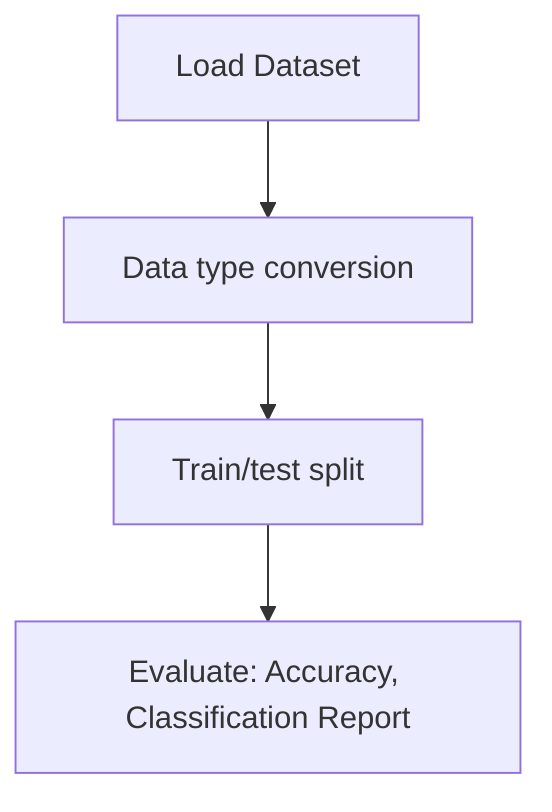

# Autoencoder Fashion MNIST

## 1. Project Overview

This project implements a **Image Classification** pipeline for **Autoencoder Fashion MNIST**.

| Property | Value |
|----------|-------|
| **ML Task** | Image Classification |
| **Dataset Status** | BLOCKED MISSING |

## 2. Dataset

> ⚠️ **Dataset not available locally.** Fashion MNIST gz files (can use keras.datasets instead)

## 3. Pipeline Overview

### Original Notebook Pipeline

**Preprocessing:**
- Data type conversion
- Train/test split

**Evaluation metrics:**
- Accuracy
- Classification Report
- Confusion Matrix
- Accuracy (Keras)
- Validation loss/accuracy
- Training loss tracking

## 4. ML Workflow



## 5. Notebook Summary

| Metric | Value |
|--------|-------|
| Total cells | 79 |
| Code cells | 55 |
| Markdown cells | 24 |

## 6. Model Details

### Evaluation Metrics

- Accuracy
- Classification Report
- Confusion Matrix
- Accuracy (Keras)
- Validation loss/accuracy
- Training loss tracking

No model training in this project.

## 7. Project Structure

```
Autoencoder Fashion MNIST/
├── Autoencoder_Fashion_MNIST.ipynb
└── README.md
```

## 8. Setup & Installation

`pip install -r requirements.txt` from the workspace root.

**Key dependencies:**

- `keras`
- `matplotlib`
- `numpy`
- `pandas`
- `scikit-learn`

## 9. How to Run

Open and run the notebook(s) sequentially:

```bash
jupyter notebook
```

- Open `Autoencoder_Fashion_MNIST.ipynb` and run all cells

## 10. Testing

Automated tests are available in `tests/test_p086_*.py`:

```bash
python -m pytest tests/test_p086_*.py -v
```

Tests validate data loading and library imports.

## 11. Limitations

- Dataset is not available locally — notebook cannot run without manual data setup
- No model training — this is an analysis/tutorial notebook only
