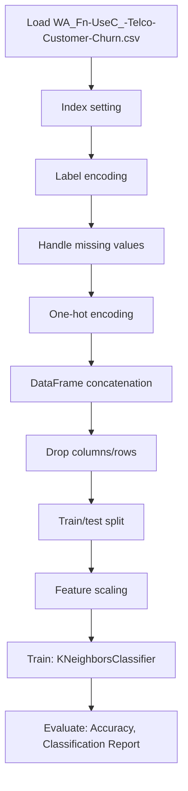

# Autoencoder for customer churn

## 1. Project Overview

This project implements a **Classification** pipeline for **Autoencoder for customer churn**.

| Property | Value |
|----------|-------|
| **ML Task** | Classification |
| **Dataset Status** | OK LOCAL |

## 2. Dataset

**Data sources detected in code:**

- `WA_Fn-UseC_-Telco-Customer-Churn.csv`

**Files in project directory:**

- `WA_Fn-UseC_-Telco-Customer-Churn.csv`

**Standardized data path:** `data/autoencoder_for_customer_churn/`

## 3. Pipeline Overview

### Original Notebook Pipeline

**Preprocessing:**
- Index setting
- Label encoding (LabelEncoder)
- Handle missing values (fillna)
- One-hot encoding (pd.get_dummies)
- DataFrame concatenation
- Drop columns/rows
- Train/test split
- Feature scaling (MinMaxScaler)

**Models trained:**
- KNeighborsClassifier

**Evaluation metrics:**
- Accuracy
- Classification Report
- Confusion Matrix
- Validation loss/accuracy
- Training loss tracking

## 4. ML Workflow



## 5. Notebook Summary

| Metric | Value |
|--------|-------|
| Total cells | 92 |
| Code cells | 53 |
| Markdown cells | 39 |
| Original models | KNeighborsClassifier |

## 6. Model Details

### Original Models

- `KNeighborsClassifier`

**Neural network architecture:**

```
  Dense(512)
```

### Evaluation Metrics

- Accuracy
- Classification Report
- Confusion Matrix
- Validation loss/accuracy
- Training loss tracking

## 7. Project Structure

```
Autoencoder for customer churn/
├── Autoencoder for Customer Churn.ipynb
├── WA_Fn-UseC_-Telco-Customer-Churn.csv
└── README.md
```

## 8. Setup & Installation

`pip install -r requirements.txt` from the workspace root.

**Key dependencies:**

- `keras`
- `matplotlib`
- `numpy`
- `pandas`
- `scikit-learn`
- `seaborn`

## 9. How to Run

Open and run the notebook(s) sequentially:

```bash
jupyter notebook
```

- Open `Autoencoder for Customer Churn.ipynb` and run all cells

## 10. Testing

Automated tests are available in `tests/test_p103_*.py`:

```bash
python -m pytest tests/test_p103_*.py -v
```

Tests validate data loading and model instantiation.

## 11. Limitations

No significant limitations detected.
