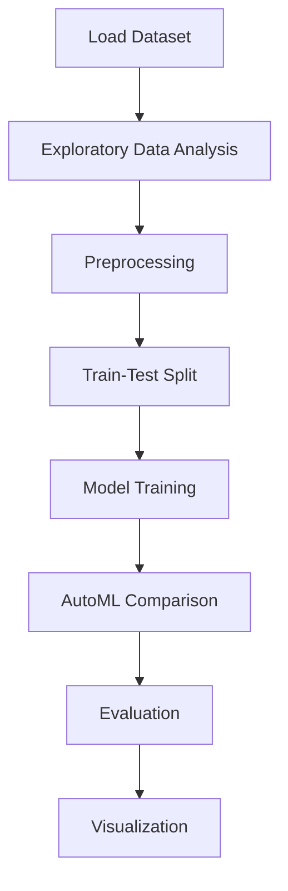

# Boston House Classification


## Project Overview

**Boston House Classification** is a **Classification** project in the **Classification** category.

> Primarily, two types of feature scaling methods:

**Target variable:** `MEDV`
**Models:** LazyRegressor, PyCaret

## Dataset

| Property | Value |
|----------|-------|
| Type | Tabular |
| Source | Local |
| Path | `data/boston_house_classification/HousingData.csv` |
| Target | `MEDV` |

```python
from core.data_loader import load_dataset
df = load_dataset('boston_house_classification')
```

## Pipeline Files

| File | Lines |
|------|-------|
| `pipeline.py` | 302 |
| `train.py` | 230 |
| `evaluate.py` | 230 |
| `boston_house_classification.ipynb` | 45 code / 13 markdown cells |
| `test_boston_house_classification.py` | test suite |

## ML Workflow



## Core Logic

### Preprocessing

- Missing value imputation
- StandardScaler normalization
- Train-test split

### Visualizations

- Correlation heatmap
- Histograms / distributions
- Scatter plots

## Models

| Model | Type |
|-------|------|
| LazyRegressor | AutoML Benchmark (30+ regressors) |
| PyCaret | AutoML Framework |

AutoML is toggled via the `USE_AUTOML` flag in pipeline scripts.
**LazyPredict** (`LazyRegressor`) benchmarks 30+ models automatically.
**PyCaret** `compare_models()` runs cross-validated comparison.

## Reproducibility

```python
random.seed(42); np.random.seed(42); os.environ['PYTHONHASHSEED'] = '42'
```

```bash
python pipeline.py --seed 123    # custom seed
python pipeline.py --reproduce   # locked seed=42
```

## Project Structure

```
Classification/Boston House Classification/
  Boston House Price Predictor.pdf
  Dataset Link.pdf
  README.md
  boston_house_classification.ipynb
  evaluate.py
  pipeline.py
  test_boston_house_classification.py
  train.py
```

## How to Run

```bash
cd "Classification/Boston House Classification"
python pipeline.py
python train.py       # training only
python evaluate.py    # evaluation only
```

## Testing

```bash
pytest "Classification/Boston House Classification/test_boston_house_classification.py" -v
```

## Setup

```bash
pip install lazypredict matplotlib numpy pandas pycaret scikit-learn seaborn
```

---
*README auto-generated from `boston_house_classification.ipynb` analysis.*