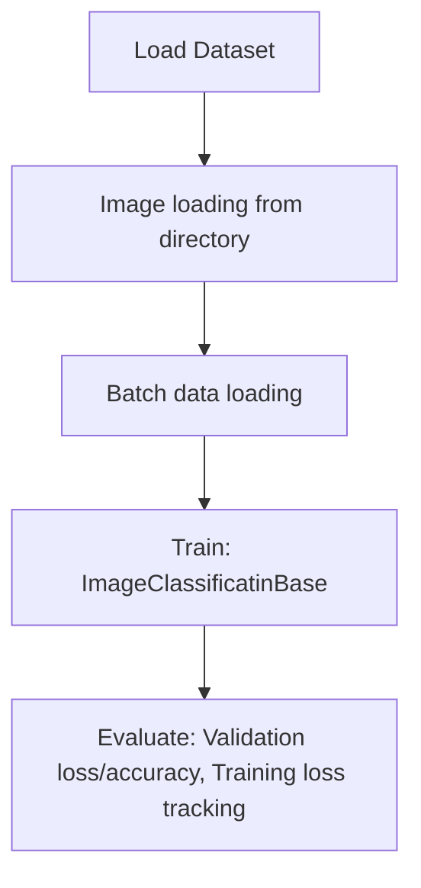

# Cifar 10

## 1. Project Overview

This project implements a **Image Classification** pipeline for **Cifar 10**.

| Property | Value |
|----------|-------|
| **ML Task** | Image Classification |
| **Dataset Status** | BLOCKED LINK ONLY |

## 2. Dataset

> ⚠️ **Dataset not available locally.** Link-only but no downloadable URL identified

## 3. Pipeline Overview

### Original Notebook Pipeline

**Preprocessing:**
- Image loading from directory (ImageFolder)
- Batch data loading (DataLoader)

**Models trained:**
- ImageClassificatinBase (Custom PyTorch)

**Evaluation metrics:**
- Validation loss/accuracy
- Training loss tracking

## 4. ML Workflow



## 5. Notebook Summary

| Metric | Value |
|--------|-------|
| Total cells | 72 |
| Code cells | 47 |
| Markdown cells | 25 |
| Original models | ImageClassificatinBase |

## 6. Model Details

### Original Models

- `ImageClassificatinBase (Custom PyTorch)`

**Neural network architecture:**

```
  Conv2d(3)
  Conv2d(32)
  Conv2d(64)
  Conv2d(128)
  Conv2d(256)
  MaxPooling
  Flatten
  Linear(1024, 512)
  Linear(512, 10)
```

### Evaluation Metrics

- Validation loss/accuracy
- Training loss tracking

## 7. Project Structure

```
Cifar 10/
├── 04_image_classification_with_CNN(Colab).ipynb
└── README.md
```

## 8. Setup & Installation

`pip install -r requirements.txt` from the workspace root.

**Key dependencies:**

- `matplotlib`
- `torch`
- `torchvision`

## 9. How to Run

Open and run the notebook(s) sequentially:

```bash
jupyter notebook
```

- Open `04_image_classification_with_CNN(Colab).ipynb` and run all cells

## 10. Testing

Automated tests are available in `tests/test_p049_*.py`:

```bash
python -m pytest tests/test_p049_*.py -v
```

Tests validate data loading and model instantiation.

## 11. Limitations

- Dataset is not available locally — notebook cannot run without manual data setup
- Hardcoded file paths detected — may need adjustment
