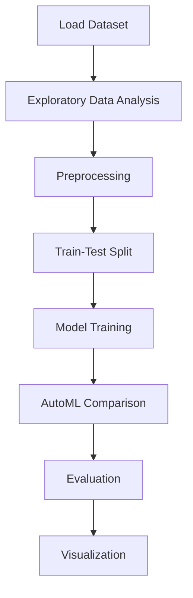

# Credit risk modeling using the German Credit Dataset


## Project Overview

**Credit risk modeling using the German Credit Dataset** is a **Classification** project in the **Classification** category.

> The German Credit data set is a publically available data set downloaded from the UCI Machine Learning Repository. The data contains data on 20 variables and the classification whether an applicant is considered a Good or a Bad credit risk for 1000 loan applicants.

**Target variable:** `Risk`
**Models:** LazyClassifier, PyCaret

## Dataset

| Property | Value |
|----------|-------|
| Type | Tabular |
| Source | Local |
| Path | `data/credit_risk_german/german_credit_data.csv` |
| Target | `Risk` |

## Pipeline Files

| File | Lines |
|------|-------|
| `pipeline.py` | 183 |
| `train.py` | 158 |
| `evaluate.py` | 183 |
| `predicting_german_credit_default.ipynb` | 7 code / 9 markdown cells |
| `test_credit_risk_modeling_using_the_german_credit_dataset.py` | test suite |

## ML Workflow



## Core Logic

### Preprocessing

- Label encoding
- One-hot encoding
- StandardScaler normalization
- MinMaxScaler normalization
- Train-test split

### Visualizations

- Confusion matrix
- ROC curve

### Helper Functions

- `get_eval1()`
- `get_eval2()`

## Models

| Model | Type |
|-------|------|
| LazyClassifier | AutoML Benchmark (30+ classifiers) |
| PyCaret | AutoML Framework |

AutoML is toggled via the `USE_AUTOML` flag in pipeline scripts.
**LazyPredict** (`LazyClassifier`) benchmarks 30+ models automatically.
**PyCaret** `compare_models()` runs cross-validated comparison.

## Reproducibility

```python
random.seed(42); np.random.seed(42); os.environ['PYTHONHASHSEED'] = '42'
```

```bash
python pipeline.py --seed 123    # custom seed
python pipeline.py --reproduce   # locked seed=42
```

## Project Structure

```
Classification/Credit risk modeling using the German Credit Dataset/
  Credit Risk modeling.pdf
  Dataset Link.pdf
  README.md
  evaluate.py
  pipeline.py
  predicting_german_credit_default.ipynb
  test_credit_risk_modeling_using_the_german_credit_dataset.py
  train.py
```

## How to Run

```bash
cd "Classification/Credit risk modeling using the German Credit Dataset"
python pipeline.py
python train.py       # training only
python evaluate.py    # evaluation only
```

## Testing

```bash
pytest "Classification/Credit risk modeling using the German Credit Dataset/test_credit_risk_modeling_using_the_german_credit_dataset.py" -v
```

## Setup

```bash
pip install lazypredict matplotlib numpy pandas pycaret scikit-learn seaborn
```

---
*README auto-generated from `predicting_german_credit_default.ipynb` analysis.*