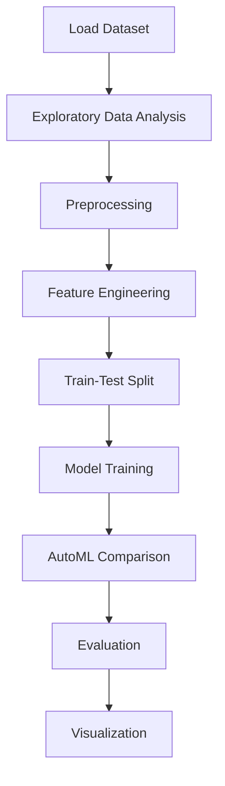

# Predicting customer churn for a telecom company


## Project Overview

**Predicting customer churn for a telecom company** is a **Classification** project in the **Classification** category.

> A problem for B2C companies, churn is when a customer stop buying all products and

**Target variable:** `customerstatus`
**Models:** DecisionTree, LazyClassifier, LogisticRegression, PyCaret, RandomForest, XGBoost

## Dataset

| Property | Value |
|----------|-------|
| Type | Tabular |
| Source | Local |
| Path | `data/customer_churn_telecom/telecom_customer_churn.csv` |
| Target | `customerstatus` |

```python
from core.data_loader import load_dataset
df = load_dataset('predicting_customer_churn_for_a_telecom_company')
```

## Pipeline Files

| File | Lines |
|------|-------|
| `pipeline.py` | 293 |
| `train.py` | 275 |
| `evaluate.py` | 275 |
| `customer-churn-prediction-on-telecom-dataset.ipynb` | 30 code / 16 markdown cells |
| `test_predicting_customer_churn_for_a_telecom_company.py` | test suite |

## ML Workflow



## Core Logic

### Preprocessing

- Missing value imputation
- Label encoding
- StandardScaler normalization
- Outlier removal
- Train-test split

### Feature Engineering

Feature engineering steps detected in notebook code cells.

### Visualizations

- Confusion matrix
- ROC curve

### Helper Functions

- `encode_data()`

## Models

| Model | Type |
|-------|------|
| DecisionTree | Tree-Based |
| LazyClassifier | AutoML Benchmark (30+ classifiers) |
| LogisticRegression | Linear Classifier |
| PyCaret | AutoML Framework |
| RandomForest | Tree-Based |
| XGBoost | Ensemble / Boosting |

AutoML is toggled via the `USE_AUTOML` flag in pipeline scripts.
**LazyPredict** (`LazyClassifier`) benchmarks 30+ models automatically.
**PyCaret** `compare_models()` runs cross-validated comparison.

## Reproducibility

```python
random.seed(42); np.random.seed(42); os.environ['PYTHONHASHSEED'] = '42'
```

```bash
python pipeline.py --seed 123    # custom seed
python pipeline.py --reproduce   # locked seed=42
```

## Project Structure

```
Classification/Predicting customer churn for a telecom company/
  Dataset Link.pdf
  Predicting customer churn for telecome company.pdf
  README.md
  customer-churn-prediction-on-telecom-dataset.ipynb
  evaluate.py
  pipeline.py
  test_predicting_customer_churn_for_a_telecom_company.py
  train.py
```

## How to Run

```bash
cd "Classification/Predicting customer churn for a telecom company"
python pipeline.py
python train.py       # training only
python evaluate.py    # evaluation only
```

## Testing

```bash
pytest "Classification/Predicting customer churn for a telecom company/test_predicting_customer_churn_for_a_telecom_company.py" -v
```

## Setup

```bash
pip install lazypredict matplotlib numpy pandas pycaret scikit-learn seaborn xgboost
```

---
*README auto-generated from `customer-churn-prediction-on-telecom-dataset.ipynb` analysis.*