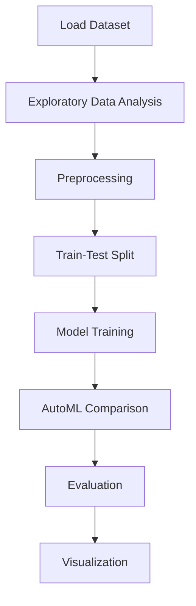

# Predicting customer lifetime value


## Project Overview

**Predicting customer lifetime value** is a **Classification** project in the **Classification** category.

> We have all the crucial information we need:

**Target variable:** `LTVCluster`
**Models:** KMeans, LazyClassifier, PyCaret, XGBoost

## Dataset

| Property | Value |
|----------|-------|
| Type | Tabular |
| Source | Local |
| Path | `data/customer_lifetime_value/data.csv` |
| Target | `LTVCluster` |

```python
from core.data_loader import load_dataset
df = load_dataset('predicting_customer_lifetime_value')
```

## Pipeline Files

| File | Lines |
|------|-------|
| `pipeline.py` | 185 |
| `train.py` | 167 |
| `evaluate.py` | 167 |
| `customer-lifetime-value-prediction.ipynb` | 17 code / 13 markdown cells |
| `test_predicting_customer_lifetime_value.py` | test suite |

## ML Workflow



## Core Logic

### Preprocessing

- Datetime feature extraction
- Train-test split

### Visualizations

- Confusion matrix

## Models

| Model | Type |
|-------|------|
| KMeans | Centroid Clustering |
| LazyClassifier | AutoML Benchmark (30+ classifiers) |
| PyCaret | AutoML Framework |
| XGBoost | Ensemble / Boosting |

AutoML is toggled via the `USE_AUTOML` flag in pipeline scripts.
**LazyPredict** (`LazyClassifier`) benchmarks 30+ models automatically.
**PyCaret** `compare_models()` runs cross-validated comparison.

## Reproducibility

```python
random.seed(42); np.random.seed(42); os.environ['PYTHONHASHSEED'] = '42'
```

```bash
python pipeline.py --seed 123    # custom seed
python pipeline.py --reproduce   # locked seed=42
```

## Project Structure

```
Classification/Predicting customer lifetime value/
  Dataset Link.pdf
  Predicting Customer lifetime value.pdf
  README.md
  customer-lifetime-value-prediction.ipynb
  evaluate.py
  pipeline.py
  test_predicting_customer_lifetime_value.py
  train.py
```

## How to Run

```bash
cd "Classification/Predicting customer lifetime value"
python pipeline.py
python train.py       # training only
python evaluate.py    # evaluation only
```

## Testing

```bash
pytest "Classification/Predicting customer lifetime value/test_predicting_customer_lifetime_value.py" -v
```

## Setup

```bash
pip install lazypredict matplotlib numpy pandas pycaret scikit-learn seaborn xgboost
```

---
*README auto-generated from `customer-lifetime-value-prediction.ipynb` analysis.*