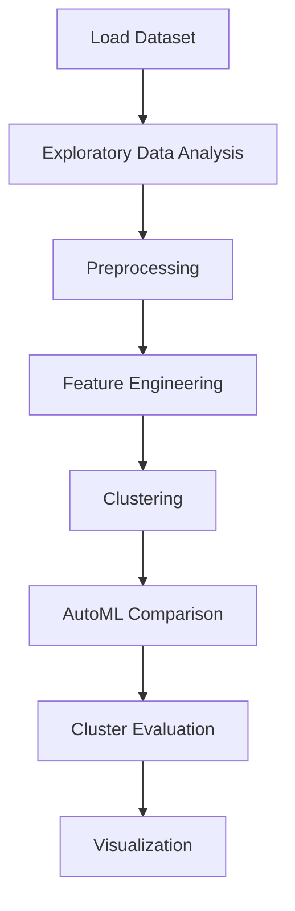

# Customer segmentation for an E-commerce company


## Project Overview

**Customer segmentation for an E-commerce company** is a **Clustering** project in the **Classification** category.

> Welcome to "RFM Customer Segmentation & Cohort Analysis Project". This is the first project of the Capstone Project Series, which consists of 4 different project that contain different scenarios.

**Models:** AgglomerativeClustering, KMeans, PyCaret

## Dataset

| Property | Value |
|----------|-------|
| Type | Tabular |
| Source | Local |
| Path | `data/customer_segmentation_ecommerce/data.csv` |

```python
from core.data_loader import load_dataset
df = load_dataset('customer_segmentation_for_an_e_commerce_company')
```

## Pipeline Files

| File | Lines |
|------|-------|
| `pipeline.py` | 1887 |
| `train.py` | 1294 |
| `evaluate.py` | 1294 |
| `customer_segmentation_e-commerce.ipynb` | 278 code / 114 markdown cells |
| `test_customer_segmentation_for_an_ecommerce_company.py` | test suite |

## ML Workflow



## Core Logic

### Preprocessing

- Missing value imputation
- Label encoding
- One-hot encoding
- StandardScaler normalization
- MinMaxScaler normalization
- RobustScaler normalization
- Log transformation
- Datetime feature extraction

### Feature Engineering

Feature engineering steps detected in notebook code cells.

### Visualizations

- Correlation heatmap
- Histograms / distributions
- Box plots
- Pair plots
- Bar charts
- Scatter plots
- Word cloud
- Elbow method
- Silhouette analysis
- Dendrogram

### Helper Functions

- `missing_values()`
- `first_looking()`
- `first_look()`
- `multicolinearity_control()`
- `duplicate_values()`
- `drop_columns()`
- `drop_null()`
- `fill_most()`
- `explore()`
- `recency_scoring()`
- `frequency_scoring()`
- `monetary_scoring()`
- `rfm_scoring()`
- `categorizer()`

## Models

| Model | Type |
|-------|------|
| AgglomerativeClustering | Hierarchical Clustering |
| KMeans | Centroid Clustering |
| PyCaret | AutoML Framework |

AutoML is toggled via the `USE_AUTOML` flag in pipeline scripts.
**PyCaret** `compare_models()` runs cross-validated comparison.

## Reproducibility

```python
random.seed(42); np.random.seed(42); os.environ['PYTHONHASHSEED'] = '42'
```

```bash
python pipeline.py --seed 123    # custom seed
python pipeline.py --reproduce   # locked seed=42
```

## Project Structure

```
Classification/Customer segmentation for an E-commerce company/
  Customer Segmentation for E commerce company.pdf
  Dataset Link.pdf
  README.md
  customer_segmentation_e-commerce.ipynb
  evaluate.py
  pipeline.py
  shokunin_United_Kingdom_map.png
  test_customer_segmentation_for_an_ecommerce_company.py
  train.py
```

## How to Run

```bash
cd "Classification/Customer segmentation for an E-commerce company"
python pipeline.py
python train.py       # training only
python evaluate.py    # evaluation only
```

## Testing

```bash
pytest "Classification/Customer segmentation for an E-commerce company/test_customer_segmentation_for_an_ecommerce_company.py" -v
```

## Setup

```bash
pip install matplotlib numpy pandas pycaret scikit-learn seaborn wordcloud
```

---
*README auto-generated from `customer_segmentation_e-commerce.ipynb` analysis.*