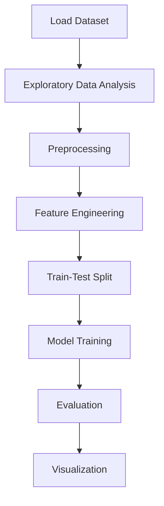

# Cyberbullying Classification


## Project Overview

**Cyberbullying Classification** is a **NLP / Text Classification** project in the **Classification** category.

> This project is about the analysis of tweets about cyberbullying, with the goal of performing a Sentiment Analysis using Bidirectional LSTM and BERT on PyTorch to predict if a tweet is about cyberbullying or not.

**Target variable:** `sentiment`
**Models:** LSTM, NLP_vectorizer, NaiveBayes

## Dataset

| Property | Value |
|----------|-------|
| Type | Text |
| Source | Local |
| Path | `data/cyberbullying_classification/cyberbullying_tweets.csv` |
| Target | `sentiment` |

```python
from core.data_loader import load_dataset
df = load_dataset('cyberbullying_classification')
```

## Pipeline Files

| File | Lines |
|------|-------|
| `pipeline.py` | 396 |
| `evaluate.py` | 352 |
| `Cyberbullying_classification.ipynb` | 42 code / 36 markdown cells |
| `test_cyberbullying_classification.py` | test suite |

## ML Workflow



## Core Logic

### Preprocessing

- TF-IDF / text vectorization
- Train-test split

### Feature Engineering

Feature engineering steps detected in notebook code cells.

### Visualizations

- Correlation heatmap
- Count plots
- Confusion matrix

### Helper Functions

- `conf_matrix()`
- `strip_emoji()`
- `strip_all_entities()`
- `decontract()`
- `clean_hashtags()`
- `filter_chars()`
- `remove_mult_spaces()`
- `stemmer()`
- `lemmatize()`
- `deep_clean()`

## Models

| Model | Type |
|-------|------|
| LSTM | Recurrent Neural Network |
| NLP_vectorizer | NLP Pipeline |
| NaiveBayes | Classifier |

## Reproducibility

```python
random.seed(42); np.random.seed(42); os.environ['PYTHONHASHSEED'] = '42'
```

```bash
python pipeline.py --seed 123    # custom seed
python pipeline.py --reproduce   # locked seed=42
```

## Project Structure

```
Classification/Cyberbullying Classification/
  Cyberbullying Classification.pdf
  Cyberbullying_classification.ipynb
  Dataset Link.pdf
  README.md
  evaluate.py
  pipeline.py
  test_cyberbullying_classification.py
```

## How to Run

```bash
cd "Classification/Cyberbullying Classification"
python pipeline.py
python evaluate.py    # evaluation only
```

## Testing

```bash
pytest "Classification/Cyberbullying Classification/test_cyberbullying_classification.py" -v
```

## Setup

```bash
pip install matplotlib nltk numpy pandas scikit-learn seaborn tensorflow
```

## Limitations

- NLP preprocessing (tokenization, stemming) is tightly coupled to the notebook implementation

---
*README auto-generated from `Cyberbullying_classification.ipynb` analysis.*