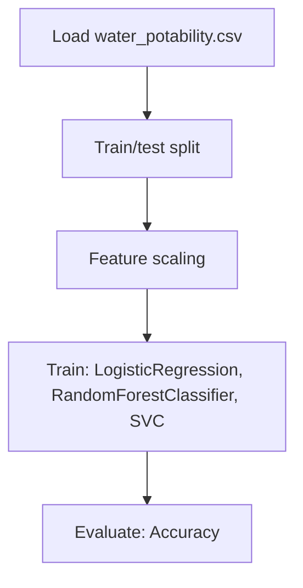

# Drinking Water Potability

## 1. Project Overview

This project implements a **Classification** pipeline for **Drinking Water Potability**.

| Property | Value |
|----------|-------|
| **ML Task** | Classification |
| **Dataset Status** | OK LOCAL |

## 2. Dataset

**Data sources detected in code:**

- `water_potability.csv`

**Files in project directory:**

- `link_to_dataset.txt`
- `water_potability.csv`

**Standardized data path:** `data/drinking_water_potability/`

## 3. Pipeline Overview

### Original Notebook Pipeline

**Preprocessing:**
- Train/test split
- Feature scaling (StandardScaler)

**Models trained:**
- LogisticRegression
- RandomForestClassifier
- SVC
- KNeighborsClassifier
- GaussianNB

**Evaluation metrics:**
- Accuracy

## 4. ML Workflow



## 5. Notebook Summary

| Metric | Value |
|--------|-------|
| Total cells | 28 |
| Code cells | 28 |
| Markdown cells | 0 |
| Original models | LogisticRegression, RandomForestClassifier, SVC, KNeighborsClassifier, GaussianNB |

## 6. Model Details

### Original Models

- `LogisticRegression`
- `RandomForestClassifier`
- `SVC`
- `KNeighborsClassifier`
- `GaussianNB`

### Evaluation Metrics

- Accuracy

## 7. Project Structure

```
Drinking Water Potability/
├── drinking-water-potability(1).ipynb
├── link_to_dataset.txt
├── water_potability.csv
└── README.md
```

## 8. Setup & Installation

`pip install -r requirements.txt` from the workspace root.

**Key dependencies:**

- `matplotlib`
- `numpy`
- `pandas`
- `scikit-learn`
- `seaborn`

## 9. How to Run

Open and run the notebook(s) sequentially:

```bash
jupyter notebook
```

- Open `drinking-water-potability(1).ipynb` and run all cells

## 10. Testing

Automated tests are available in `tests/test_p078_*.py`:

```bash
python -m pytest tests/test_p078_*.py -v
```

Tests validate data loading and model instantiation.

## 11. Limitations

No significant limitations detected.
