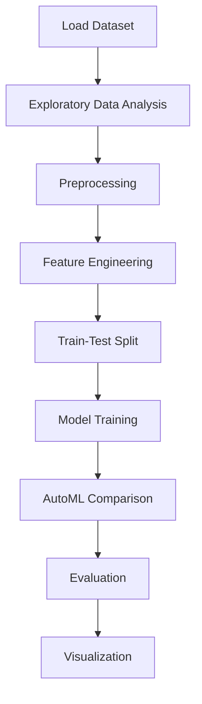

# Drug Classification


## Project Overview

**Drug Classification** is a **Classification** project in the **Classification** category.

> on specific drugs along with related conditions and a 10-star patient rating reflecting the overall patient satisfaction. The data was obtained by crawling online pharmaceutical review sites. The Drug Review Data Set is of shape (161297, 7) i.e. It has 7 features including the review and 161297 Data Points or entries.

**Target variable:** `Drug`
**Models:** LazyClassifier, LightGBM, PyCaret, XGBoost

## Dataset

| Property | Value |
|----------|-------|
| Type | Tabular |
| Source | Local |
| Path | `data/drug_classification/drugsComTrain_raw.csv` |
| Target | `Drug` |

```python
from core.data_loader import load_dataset
df = load_dataset('drug_classification')
```

## Pipeline Files

| File | Lines |
|------|-------|
| `pipeline.py` | 538 |
| `train.py` | 455 |
| `evaluate.py` | 455 |
| `Drug_Classification.ipynb` | 45 code / 37 markdown cells |
| `test_drug_classification.py` | test suite |

## ML Workflow



## Core Logic

### Preprocessing

- Missing value imputation
- Label encoding
- Datetime feature extraction
- Train-test split

### Feature Engineering

Feature engineering steps detected in notebook code cells.

### Visualizations

- Correlation heatmap
- Histograms / distributions
- Count plots
- Bar charts
- Confusion matrix
- Word cloud
- Feature importance

### Helper Functions

- `review_clean()`
- `sentiment()`

## Models

| Model | Type |
|-------|------|
| LazyClassifier | AutoML Benchmark (30+ classifiers) |
| LightGBM | Ensemble / Boosting |
| PyCaret | AutoML Framework |
| XGBoost | Ensemble / Boosting |

AutoML is toggled via the `USE_AUTOML` flag in pipeline scripts.
**LazyPredict** (`LazyClassifier`) benchmarks 30+ models automatically.
**PyCaret** `compare_models()` runs cross-validated comparison.

## Reproducibility

```python
random.seed(42); np.random.seed(42); os.environ['PYTHONHASHSEED'] = '42'
```

```bash
python pipeline.py --seed 123    # custom seed
python pipeline.py --reproduce   # locked seed=42
```

## Project Structure

```
Classification/Drug Classification/
  Dataset Link.pdf
  Drug_Classification.ipynb
  README.md
  evaluate.py
  pipeline.py
  test_drug_classification.py
  train.py
```

## How to Run

```bash
cd "Classification/Drug Classification"
python pipeline.py
python train.py       # training only
python evaluate.py    # evaluation only
```

## Testing

```bash
pytest "Classification/Drug Classification/test_drug_classification.py" -v
```

## Setup

```bash
pip install lazypredict lightgbm matplotlib nltk numpy pandas pycaret scikit-learn seaborn textblob wordcloud xgboost
```

---
*README auto-generated from `Drug_Classification.ipynb` analysis.*