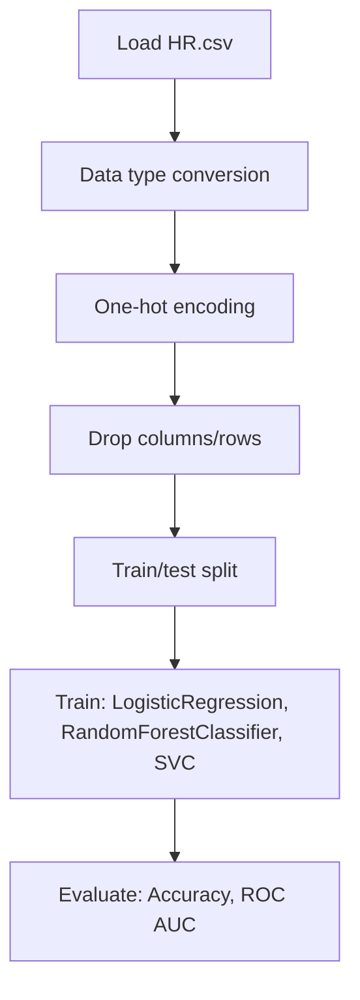

# Employee_Turnover

## 1. Project Overview

This project implements a **Classification** pipeline for **Employee_Turnover**.

| Property | Value |
|----------|-------|
| **ML Task** | Classification |
| **Dataset Status** | OK LOCAL |

## 2. Dataset

**Data sources detected in code:**

- `HR.csv`

**Files in project directory:**

- `HR_comma_sep.csv`

**Standardized data path:** `data/employee_turnover/`

## 3. Pipeline Overview

### Original Notebook Pipeline

**Preprocessing:**
- Data type conversion
- One-hot encoding (pd.get_dummies)
- Drop columns/rows
- Train/test split

**Models trained:**
- LogisticRegression
- RandomForestClassifier
- SVC

**Evaluation metrics:**
- Accuracy
- ROC AUC
- Classification Report
- Confusion Matrix
- Cross-Validation Score

## 4. ML Workflow



## 5. Notebook Summary

| Metric | Value |
|--------|-------|
| Total cells | 57 |
| Code cells | 42 |
| Markdown cells | 15 |
| Original models | LogisticRegression, RandomForestClassifier, SVC |

**⚠️ Deprecated APIs detected:**

- `sklearn.cross_validation` removed — use `sklearn.model_selection`

## 6. Model Details

### Original Models

- `LogisticRegression`
- `RandomForestClassifier`
- `SVC`

### Evaluation Metrics

- Accuracy
- ROC AUC
- Classification Report
- Confusion Matrix
- Cross-Validation Score

## 7. Project Structure

```
Employee_Turnover/
├── Employee_Turnover.ipynb
├── HR_comma_sep.csv
└── README.md
```

## 8. Setup & Installation

`pip install -r requirements.txt` from the workspace root.

**Key dependencies:**

- `matplotlib`
- `numpy`
- `pandas`
- `scikit-learn`
- `seaborn`

## 9. How to Run

Open and run the notebook(s) sequentially:

```bash
jupyter notebook
```

- Open `Employee_Turnover.ipynb` and run all cells

## 10. Testing

Automated tests are available in `tests/test_p140_*.py`:

```bash
python -m pytest tests/test_p140_*.py -v
```

Tests validate data loading and model instantiation.

## 11. Limitations

- `sklearn.cross_validation` removed — use `sklearn.model_selection`
