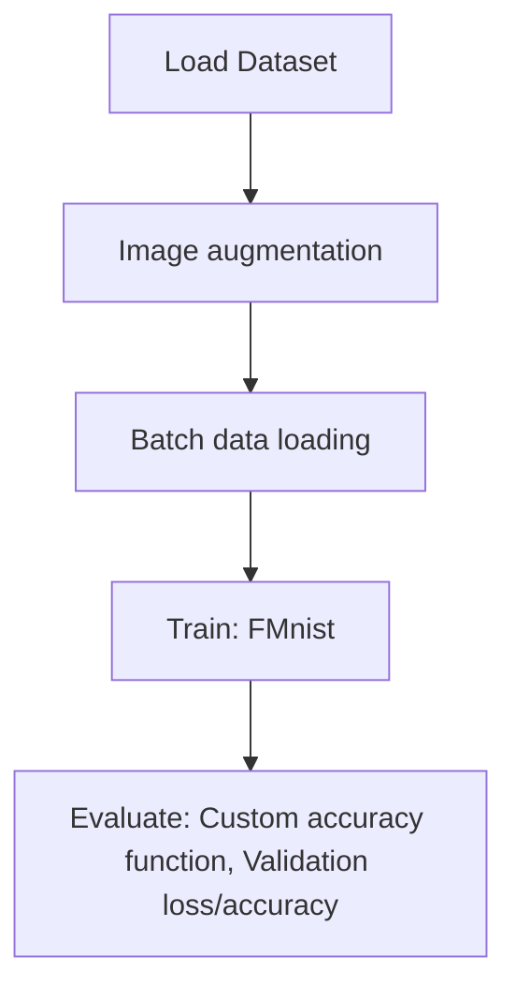

# Fashion Mnist Data Analysis Using ML

## 1. Project Overview

This project implements a **Image Classification** pipeline for **Fashion Mnist Data Analysis Using ML**.

| Property | Value |
|----------|-------|
| **ML Task** | Image Classification |
| **Dataset Status** | OK BUILTIN |

## 2. Dataset

## 3. Pipeline Overview

### Original Notebook Pipeline

**Preprocessing:**
- Image augmentation
- Batch data loading (DataLoader)

**Models trained:**
- FMnist (Custom PyTorch)

**Evaluation metrics:**
- Custom accuracy function
- Validation loss/accuracy

## 4. ML Workflow



## 5. Notebook Summary

| Metric | Value |
|--------|-------|
| Total cells | 30 |
| Code cells | 30 |
| Markdown cells | 0 |
| Original models | FMnist |

## 6. Model Details

### Original Models

- `FMnist (Custom PyTorch)`

**Neural network architecture:**

```
  Conv2d(1)
  Conv2d(16)
  MaxPooling
  BatchNorm
  Linear(1568, 10)
```

### Evaluation Metrics

- Custom accuracy function
- Validation loss/accuracy

## 7. Project Structure

```
Fashion Mnist Data Analysis Using ML/
├── F_Mnist_model.ipynb
└── README.md
```

## 8. Setup & Installation

`pip install -r requirements.txt` from the workspace root.

**Key dependencies:**

- `matplotlib`
- `torch`
- `torchvision`

## 9. How to Run

Open and run the notebook(s) sequentially:

```bash
jupyter notebook
```

- Open `F_Mnist_model.ipynb` and run all cells

## 10. Testing

Automated tests are available in `tests/test_p019_*.py`:

```bash
python -m pytest tests/test_p019_*.py -v
```

Tests validate data loading and model instantiation.

## 11. Limitations

- Hardcoded file paths detected — may need adjustment
- No train/test split detected in code
