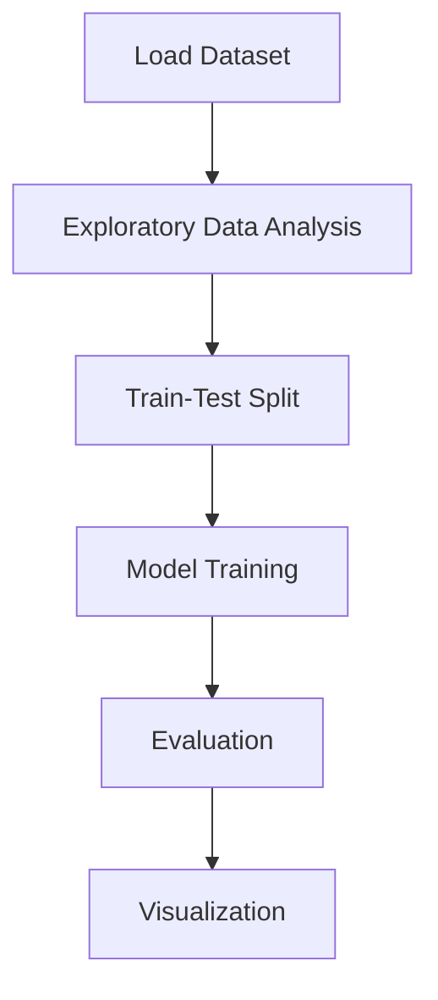

# Garbage Classification


## Project Overview

**Garbage Classification** is a **Image Classification** project in the **Classification** category.

> Garbage segregation involves separating wastes according to how it's handled or processed. It's important for recycling as some materials are recyclable and others are not.

**Target variable:** `image_class_label`
**Models:** CV_pipeline

## Dataset

| Property | Value |
|----------|-------|
| Type | Image |
| Source | Local |
| Path | `data/garbage_classification/Garbage classification/Garbage classification` |
| Target | `image_class_label` |
| Fallback | `manual_required` |

## Pipeline Files

| File | Lines |
|------|-------|
| `pipeline.py` | 77 |
| `Garbage_Classification.ipynb` | 7 code / 7 markdown cells |
| `test_garbage_classification.py` | test suite |

## ML Workflow



## Core Logic

## Models

| Model | Type |
|-------|------|
| CV_pipeline | CV Pipeline |

## Reproducibility

```python
random.seed(42); np.random.seed(42); os.environ['PYTHONHASHSEED'] = '42'
```

```bash
python pipeline.py --seed 123    # custom seed
python pipeline.py --reproduce   # locked seed=42
```

## Project Structure

```
Classification/Garbage Classification/
  Dataset Link.pdf
  Garbage Classification.pdf
  Garbage_Classification.ipynb
  README.md
  pipeline.py
  test_garbage_classification.py
```

## How to Run

```bash
cd "Classification/Garbage Classification"
python pipeline.py
```

## Testing

```bash
pytest "Classification/Garbage Classification/test_garbage_classification.py" -v
```

## Setup

```bash
pip install matplotlib numpy pandas scikit-learn seaborn
```

## Limitations

- Dataset requires manual download — not included in repository
- Image pipeline expects a specific directory structure with class-label subfolders

---
*README auto-generated from `Garbage_Classification.ipynb` analysis.*