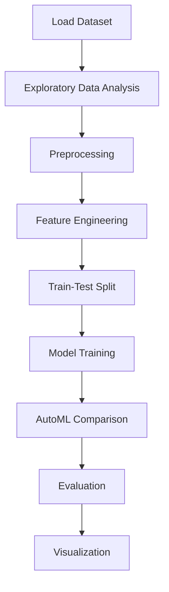

# Glass Classification


## Project Overview

**Glass Classification** is a **Classification** project in the **Classification** category.

> Let us first begin by loading the libraries that we'll use in the notebook

**Target variable:** `Type`
**Models:** DecisionTree, GradientBoosting, LazyClassifier, LogisticRegression, PyCaret, RandomForest, XGBoost

## Dataset

| Property | Value |
|----------|-------|
| Type | Tabular |
| Source | Local |
| Path | `data/glass_classification/glass.csv` |
| Target | `Type` |

```python
from core.data_loader import load_dataset
df = load_dataset('glass_classification')
```

## Pipeline Files

| File | Lines |
|------|-------|
| `pipeline.py` | 321 |
| `train.py` | 252 |
| `evaluate.py` | 252 |
| `Glass_classification.ipynb` | 29 code / 34 markdown cells |
| `test_glass_classification.py` | test suite |

## ML Workflow



## Core Logic

### Preprocessing

- Missing value imputation
- StandardScaler normalization
- Outlier removal
- Train-test split

### Feature Engineering

Feature engineering steps detected in notebook code cells.

### Visualizations

- Correlation heatmap
- Histograms / distributions
- Count plots
- Box plots
- Pair plots
- Feature importance

### Helper Functions

- `outlier_hunt()`

## Models

| Model | Type |
|-------|------|
| DecisionTree | Tree-Based |
| GradientBoosting | Ensemble / Boosting |
| LazyClassifier | AutoML Benchmark (30+ classifiers) |
| LogisticRegression | Linear Classifier |
| PyCaret | AutoML Framework |
| RandomForest | Tree-Based |
| XGBoost | Ensemble / Boosting |

AutoML is toggled via the `USE_AUTOML` flag in pipeline scripts.
**LazyPredict** (`LazyClassifier`) benchmarks 30+ models automatically.
**PyCaret** `compare_models()` runs cross-validated comparison.

## Reproducibility

```python
random.seed(42); np.random.seed(42); os.environ['PYTHONHASHSEED'] = '42'
```

```bash
python pipeline.py --seed 123    # custom seed
python pipeline.py --reproduce   # locked seed=42
```

## Project Structure

```
Classification/Glass Classification/
  Dataset Link.pdf
  Glass Classification.pdf
  Glass_classification.ipynb
  README.md
  evaluate.py
  pipeline.py
  test_glass_classification.py
  train.py
```

## How to Run

```bash
cd "Classification/Glass Classification"
python pipeline.py
python train.py       # training only
python evaluate.py    # evaluation only
```

## Testing

```bash
pytest "Classification/Glass Classification/test_glass_classification.py" -v
```

## Setup

```bash
pip install lazypredict matplotlib numpy pandas pycaret scikit-learn seaborn xgboost
```

---
*README auto-generated from `Glass_classification.ipynb` analysis.*