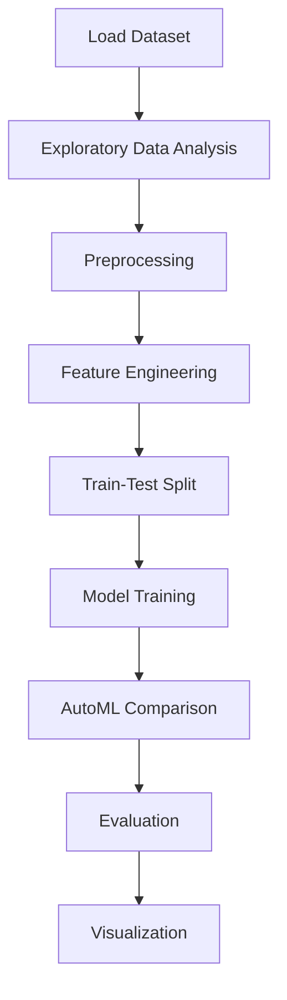

# Predicting loan default


## Project Overview

**Predicting loan default** is a **Classification** project in the **Classification** category.

> Quick automated comparison of multiple models to establish baselines.

**Target variable:** `loss`
**Models:** LazyClassifier, PyCaret

## Dataset

| Property | Value |
|----------|-------|
| Type | Tabular |
| Source | Local |
| Path | `data/loan_default_prediction/Loan_Default.csv` |
| Target | `loss` |
| Fallback | `manual_required` |

```python
from core.data_loader import load_dataset
df = load_dataset('predicting_loan_default')
```

## Pipeline Files

| File | Lines |
|------|-------|
| `pipeline.py` | 410 |
| `train.py` | 348 |
| `evaluate.py` | 348 |
| `loan-default-prediction.ipynb` | 30 code / 2 markdown cells |
| `test_predicting_loan_default.py` | test suite |

## ML Workflow



## Core Logic

### Preprocessing

- Missing value imputation
- Label encoding
- StandardScaler normalization
- Train-test split

### Feature Engineering

Feature engineering steps detected in notebook code cells.

### Visualizations

- Histograms / distributions

### Helper Functions

- `missing_values_table()`
- `remove_collinear_features()`

## Models

| Model | Type |
|-------|------|
| LazyClassifier | AutoML Benchmark (30+ classifiers) |
| PyCaret | AutoML Framework |

AutoML is toggled via the `USE_AUTOML` flag in pipeline scripts.
**LazyPredict** (`LazyClassifier`) benchmarks 30+ models automatically.
**PyCaret** `compare_models()` runs cross-validated comparison.

## Reproducibility

```python
random.seed(42); np.random.seed(42); os.environ['PYTHONHASHSEED'] = '42'
```

```bash
python pipeline.py --seed 123    # custom seed
python pipeline.py --reproduce   # locked seed=42
```

## Project Structure

```
Classification/Predicting loan default/
  Dataset Link.pdf
  Predicting Loan Default.pdf
  README.md
  evaluate.py
  loan-default-prediction.ipynb
  pipeline.py
  test_predicting_loan_default.py
  train.py
```

## How to Run

```bash
cd "Classification/Predicting loan default"
python pipeline.py
python train.py       # training only
python evaluate.py    # evaluation only
```

## Testing

```bash
pytest "Classification/Predicting loan default/test_predicting_loan_default.py" -v
```

## Setup

```bash
pip install lazypredict matplotlib numpy pandas pycaret scikit-learn seaborn
```

## Limitations

- Dataset requires manual download — not included in repository

---
*README auto-generated from `loan-default-prediction.ipynb` analysis.*