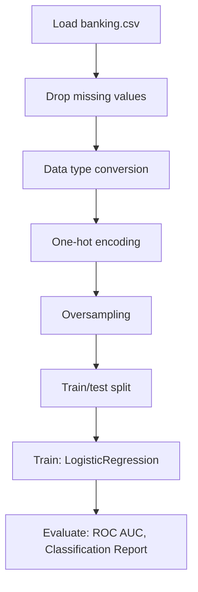

# Logistic Regression balanced

## 1. Project Overview

This project implements a **Regression** pipeline for **Logistic Regression balanced**.

| Property | Value |
|----------|-------|
| **ML Task** | Regression |
| **Dataset Status** | OK LOCAL |

## 2. Dataset

**Data sources detected in code:**

- `banking.csv`

**Files in project directory:**

- `BankChurners.csv`

**Standardized data path:** `data/logistic_regression_balanced/`

## 3. Pipeline Overview

### Original Notebook Pipeline

**Preprocessing:**
- Drop missing values (dropna)
- Data type conversion
- One-hot encoding (pd.get_dummies)
- Oversampling (SMOTE)
- Train/test split

**Models trained:**
- LogisticRegression

**Evaluation metrics:**
- ROC AUC
- Classification Report
- Confusion Matrix
- Model Score

## 4. ML Workflow



## 5. Notebook Summary

| Metric | Value |
|--------|-------|
| Total cells | 58 |
| Code cells | 34 |
| Markdown cells | 24 |
| Original models | LogisticRegression |

## 6. Model Details

### Original Models

- `LogisticRegression`

### Evaluation Metrics

- ROC AUC
- Classification Report
- Confusion Matrix
- Model Score

## 7. Project Structure

```
Logistic Regression balanced/
├── Logistic Regression balanced.ipynb
├── BankChurners.csv
└── README.md
```

## 8. Setup & Installation

`pip install -r requirements.txt` from the workspace root.

**Key dependencies:**

- `imbalanced-learn`
- `matplotlib`
- `numpy`
- `pandas`
- `scikit-learn`
- `seaborn`
- `statsmodels`

## 9. How to Run

Open and run the notebook(s) sequentially:

```bash
jupyter notebook
```

- Open `Logistic Regression balanced.ipynb` and run all cells

## 10. Testing

Automated tests are available in `tests/test_p143_*.py`:

```bash
python -m pytest tests/test_p143_*.py -v
```

Tests validate data loading and model instantiation.

## 11. Limitations

No significant limitations detected.
