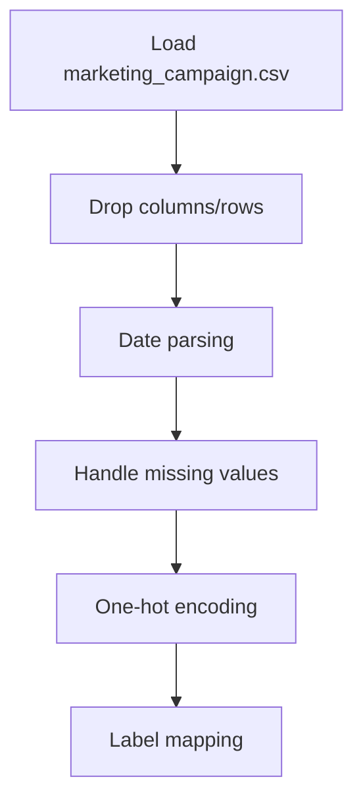

# Marketing Campaign Result Prediction

## 1. Project Overview

This project implements a **Regression** pipeline for **Marketing Campaign Result Prediction**.

| Property | Value |
|----------|-------|
| **ML Task** | Regression |
| **Dataset Status** | OK LOCAL |

## 2. Dataset

**Data sources detected in code:**

- `marketing_campaign.csv`

**Files in project directory:**

- `marketing_campaign.csv`
- `marketing_campaign.xlsx`

**Standardized data path:** `data/marketing_campaign_result_prediction/`

## 3. Pipeline Overview

### Original Notebook Pipeline

**Preprocessing:**
- Drop columns/rows
- Date parsing
- Handle missing values (fillna)
- One-hot encoding (OneHotEncoder)
- Label mapping (function)

## 4. ML Workflow



## 5. Notebook Summary

| Metric | Value |
|--------|-------|
| Total cells | 24 |
| Code cells | 24 |
| Markdown cells | 0 |

## 6. Model Details

No model training in this project.

## 7. Project Structure

```
Marketing Campaign Result Prediction/
├── predict-response-by-using-random forest(1).ipynb
├── marketing_campaign.csv
├── marketing_campaign.xlsx
├── link_to_dataset
└── README.md
```

## 8. Setup & Installation

`pip install -r requirements.txt` from the workspace root.

**Key dependencies:**

- `numpy`
- `pandas`
- `scikit-learn`

## 9. How to Run

Open and run the notebook(s) sequentially:

```bash
jupyter notebook
```

- Open `predict-response-by-using-random forest(1).ipynb` and run all cells

## 10. Testing

Automated tests are available in `tests/test_p082_*.py`:

```bash
python -m pytest tests/test_p082_*.py -v
```

Tests validate data loading and library imports.

## 11. Limitations

- No model training — this is an analysis/tutorial notebook only
