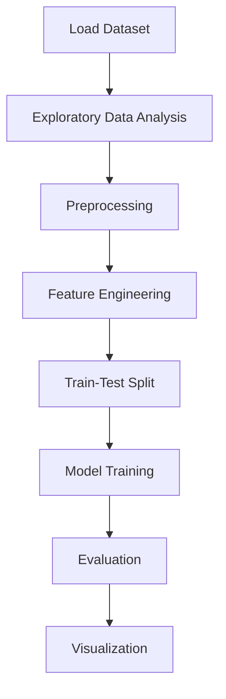

# Movie Genre Classification


## Project Overview

**Movie Genre Classification** is a **NLP / Text Classification** project in the **Classification** category.
**Target variable:** `genre`
**Models:** NLP_vectorizer

## Dataset

| Property | Value |
|----------|-------|
| Type | Text |
| Source | Local |
| Path | `data/movie_genre_classification/Genre Classification Dataset/train_data.txt` |
| Target | `genre` |
| Fallback | `manual_required` |

```python
from core.data_loader import load_dataset
df = load_dataset('movie_genre_classification')
```

## Pipeline Files

| File | Lines |
|------|-------|
| `pipeline.py` | 227 |
| `movies_genre_classification.ipynb` | 23 code / 4 markdown cells |
| `test_movie_genre_classification.py` | test suite |

## ML Workflow



## Core Logic

### Preprocessing

- TF-IDF / text vectorization

### Feature Engineering

Feature engineering steps detected in notebook code cells.

### Visualizations

- Count plots
- Word cloud

## Models

| Model | Type |
|-------|------|
| NLP_vectorizer | NLP Pipeline |

## Reproducibility

```python
random.seed(42); np.random.seed(42); os.environ['PYTHONHASHSEED'] = '42'
```

```bash
python pipeline.py --seed 123    # custom seed
python pipeline.py --reproduce   # locked seed=42
```

## Project Structure

```
Classification/Movie Genre Classification/
  Dataset Link.pdf
  Movie Genre Classification.pdf
  README.md
  movies_genre_classification.ipynb
  pipeline.py
  test_movie_genre_classification.py
```

## How to Run

```bash
cd "Classification/Movie Genre Classification"
python pipeline.py
```

## Testing

```bash
pytest "Classification/Movie Genre Classification/test_movie_genre_classification.py" -v
```

## Setup

```bash
pip install matplotlib nltk numpy pandas scikit-learn seaborn wordcloud
```

## Limitations

- Dataset requires manual download — not included in repository
- NLP preprocessing (tokenization, stemming) is tightly coupled to the notebook implementation

---
*README auto-generated from `movies_genre_classification.ipynb` analysis.*