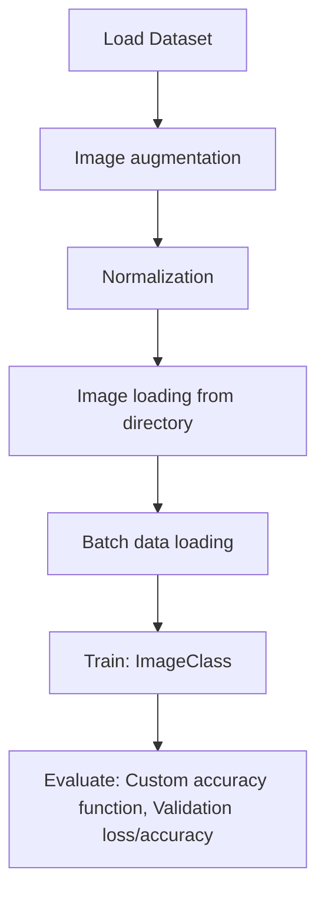

# Plant Diseases Recognition

## 1. Project Overview

This project implements a **Image Classification** pipeline for **Plant Diseases Recognition**.

| Property | Value |
|----------|-------|
| **ML Task** | Image Classification |
| **Dataset Status** | BLOCKED KAGGLE |

## 2. Dataset

> ⚠️ **Dataset not available locally.** kaggle: vipoooool/new-plant-diseases-dataset

## 3. Pipeline Overview

### Original Notebook Pipeline

**Preprocessing:**
- Image augmentation
- Normalization
- Image loading from directory (ImageFolder)
- Batch data loading (DataLoader)

**Models trained:**
- ImageClass (Custom PyTorch)

**Evaluation metrics:**
- Custom accuracy function
- Validation loss/accuracy

## 4. ML Workflow



## 5. Notebook Summary

| Metric | Value |
|--------|-------|
| Total cells | 36 |
| Code cells | 32 |
| Markdown cells | 4 |
| Original models | ImageClass |

## 6. Model Details

### Original Models

- `ImageClass (Custom PyTorch)`

**Neural network architecture:**

```
  MaxPooling
  BatchNorm
  Flatten
  Linear(49152, 38)
  Linear(49152, 32)
  Linear(32, 64)
  Linear(64, 38)
  Linear(128, 38)
```

### Evaluation Metrics

- Custom accuracy function
- Validation loss/accuracy

## 7. Project Structure

```
Plant Diseases Recognition/
├── recognition-plant-diseases-by-leaf.ipynb
└── README.md
```

## 8. Setup & Installation

`pip install -r requirements.txt` from the workspace root.

**Key dependencies:**

- `matplotlib`
- `torch`
- `torchvision`

## 9. How to Run

Open and run the notebook(s) sequentially:

```bash
jupyter notebook
```

- Open `recognition-plant-diseases-by-leaf.ipynb` and run all cells

## 10. Testing

Automated tests are available in `tests/test_p029_*.py`:

```bash
python -m pytest tests/test_p029_*.py -v
```

Tests validate data loading and model instantiation.

## 11. Limitations

- Dataset is not available locally — notebook cannot run without manual data setup
- No train/test split detected in code
