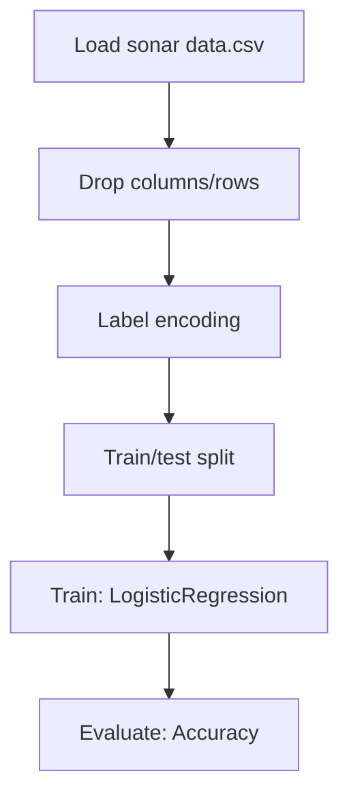

# SONAR Rock vs Mine Prediction

## 1. Project Overview

This project implements a **Classification** pipeline for **SONAR Rock vs Mine Prediction**. The target variable is `salary`.

| Property | Value |
|----------|-------|
| **ML Task** | Classification |
| **Target Variable** | `salary` |
| **Dataset Status** | OK LOCAL |

## 2. Dataset

**Data sources detected in code:**

- `sonar data.csv`

**Files in project directory:**

- `sonar data.csv`

**Standardized data path:** `data/sonar_rock_vs_mine_prediction/`

## 3. Pipeline Overview

### Original Notebook Pipeline

**Preprocessing:**
- Drop columns/rows
- Label encoding (LabelEncoder)
- Train/test split

**Models trained:**
- LogisticRegression

**Evaluation metrics:**
- Accuracy

## 4. ML Workflow



## 5. Notebook Summary

| Metric | Value |
|--------|-------|
| Total cells | 29 |
| Code cells | 25 |
| Markdown cells | 4 |
| Original models | LogisticRegression |

## 6. Model Details

### Original Models

- `LogisticRegression`

### Evaluation Metrics

- Accuracy

## 7. Project Structure

```
Project 1- SONAR Rock vs Mine Prediction/
├── SONAR Rock vs Mine Prediction Pyspark.ipynb
├── SONAR Rock vs Mine Prediction.ipynb
├── sonar data.csv
└── README.md
```

## 8. Setup & Installation

`pip install -r requirements.txt` from the workspace root.

**Key dependencies:**

- `numpy`
- `pandas`
- `scikit-learn`

## 9. How to Run

Open and run the notebook(s) sequentially:

```bash
jupyter notebook
```

- Open `SONAR Rock vs Mine Prediction Pyspark.ipynb` and run all cells
- Open `SONAR Rock vs Mine Prediction.ipynb` and run all cells

## 10. Testing

Automated tests are available in `tests/test_p001_*.py`:

```bash
python -m pytest tests/test_p001_*.py -v
```

Tests validate data loading and model instantiation.

## 11. Limitations

No significant limitations detected.
