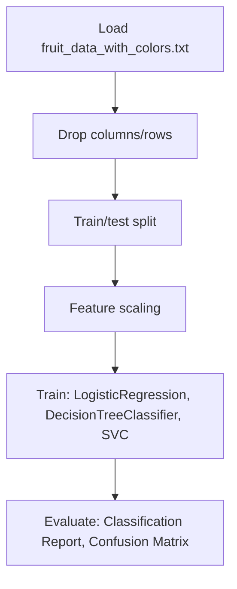

# Solving A Simple Classification Problem with Python

## 1. Project Overview

This project implements a **Classification** pipeline for **Solving A Simple Classification Problem with Python**.

| Property | Value |
|----------|-------|
| **ML Task** | Classification |
| **Dataset Status** | OK LOCAL |

## 2. Dataset

**Data sources detected in code:**

- `fruit_data_with_colors.txt`

**Files in project directory:**

- `fruit_data_with_colors.txt`

**Standardized data path:** `data/solving_a_simple_classification_problem_with_python/`

## 3. Pipeline Overview

### Original Notebook Pipeline

**Preprocessing:**
- Drop columns/rows
- Train/test split
- Feature scaling (MinMaxScaler)

**Models trained:**
- LogisticRegression
- DecisionTreeClassifier
- SVC
- KNeighborsClassifier
- GaussianNB

**Evaluation metrics:**
- Classification Report
- Confusion Matrix
- Model Score

## 4. ML Workflow



## 5. Notebook Summary

| Metric | Value |
|--------|-------|
| Total cells | 47 |
| Code cells | 28 |
| Markdown cells | 19 |
| Original models | LogisticRegression, DecisionTreeClassifier, SVC, KNeighborsClassifier, GaussianNB |

## 6. Model Details

### Original Models

- `LogisticRegression`
- `DecisionTreeClassifier`
- `SVC`
- `KNeighborsClassifier`
- `GaussianNB`

### Evaluation Metrics

- Classification Report
- Confusion Matrix
- Model Score

## 7. Project Structure

```
Solving A Simple Classification Problem with Python/
├── Solving A Simple Classification Problem with Python.ipynb
├── fruit_data_with_colors.txt
└── README.md
```

## 8. Setup & Installation

`pip install -r requirements.txt` from the workspace root.

**Key dependencies:**

- `matplotlib`
- `numpy`
- `pandas`
- `scikit-learn`
- `seaborn`

## 9. How to Run

Open and run the notebook(s) sequentially:

```bash
jupyter notebook
```

- Open `Solving A Simple Classification Problem with Python.ipynb` and run all cells

## 10. Testing

Automated tests are available in `tests/test_p120_*.py`:

```bash
python -m pytest tests/test_p120_*.py -v
```

Tests validate data loading and model instantiation.

## 11. Limitations

No significant limitations detected.
