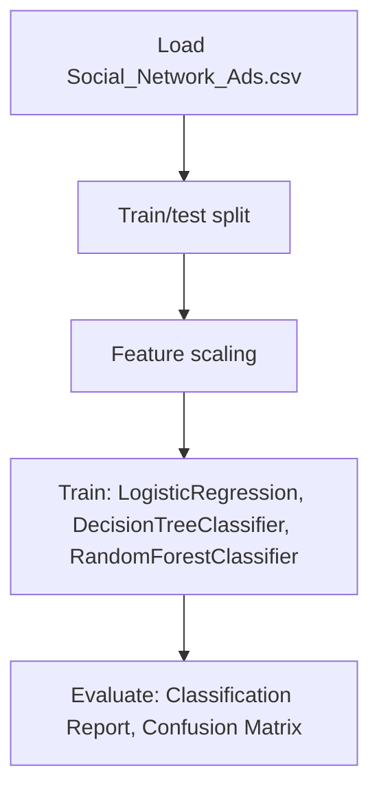

# Social Network Ads Result Analysis

## 1. Project Overview

This project implements a **Classification** pipeline for **Social Network Ads Result Analysis**.

| Property | Value |
|----------|-------|
| **ML Task** | Classification |
| **Dataset Status** | OK LOCAL |

## 2. Dataset

**Data sources detected in code:**

- `Social_Network_Ads.csv`

**Files in project directory:**

- `Social_Network_Ads.csv`

**Standardized data path:** `data/social_network_ads_result_analysis/`

## 3. Pipeline Overview

### Original Notebook Pipeline

**Preprocessing:**
- Train/test split
- Feature scaling (StandardScaler)

**Models trained:**
- LogisticRegression
- DecisionTreeClassifier
- RandomForestClassifier
- GradientBoostingClassifier
- AdaBoostClassifier
- SVC
- KNeighborsClassifier
- XGBClassifier

**Evaluation metrics:**
- Classification Report
- Confusion Matrix
- Model Score

## 4. ML Workflow



## 5. Notebook Summary

| Metric | Value |
|--------|-------|
| Total cells | 36 |
| Code cells | 36 |
| Markdown cells | 0 |
| Original models | LogisticRegression, DecisionTreeClassifier, RandomForestClassifier, GradientBoostingClassifier, AdaBoostClassifier, SVC, KNeighborsClassifier, XGBClassifier |

**⚠️ Deprecated APIs detected:**

- `sns.distplot()` is deprecated — use `sns.displot()` or `sns.histplot()`

## 6. Model Details

### Original Models

- `LogisticRegression`
- `DecisionTreeClassifier`
- `RandomForestClassifier`
- `GradientBoostingClassifier`
- `AdaBoostClassifier`
- `SVC`
- `KNeighborsClassifier`
- `XGBClassifier`

### Evaluation Metrics

- Classification Report
- Confusion Matrix
- Model Score

## 7. Project Structure

```
Social Network Ads Result Analysis/
├── prediction-of-if-the-item-is-purchase(1).ipynb
├── Social_Network_Ads.csv
├── link_to_dataset
└── README.md
```

## 8. Setup & Installation

`pip install -r requirements.txt` from the workspace root.

**Key dependencies:**

- `matplotlib`
- `numpy`
- `pandas`
- `scikit-learn`
- `seaborn`
- `xgboost`

## 9. How to Run

Open and run the notebook(s) sequentially:

```bash
jupyter notebook
```

- Open `prediction-of-if-the-item-is-purchase(1).ipynb` and run all cells

## 10. Testing

Automated tests are available in `tests/test_p154_*.py`:

```bash
python -m pytest tests/test_p154_*.py -v
```

Tests validate data loading and model instantiation.

## 11. Limitations

- `sns.distplot()` is deprecated — use `sns.displot()` or `sns.histplot()`
