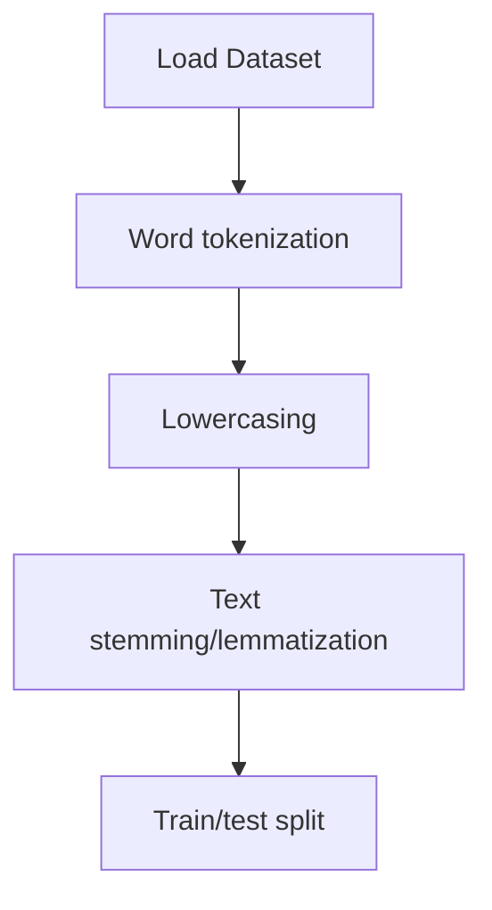

# Spam Email Classification

## 1. Project Overview

This project implements a **Classification** pipeline for **Spam Email Classification**.

| Property | Value |
|----------|-------|
| **ML Task** | Classification |
| **Dataset Status** | BLOCKED LINK ONLY |

## 2. Dataset

> ⚠️ **Dataset not available locally.** Link-only but no downloadable URL identified

## 3. Pipeline Overview

### Original Notebook Pipeline

**Preprocessing:**
- Word tokenization (NLTK)
- Lowercasing
- Text stemming/lemmatization
- Train/test split

## 4. ML Workflow



## 5. Notebook Summary

| Metric | Value |
|--------|-------|
| Total cells | 19 |
| Code cells | 17 |
| Markdown cells | 2 |

## 6. Model Details

No model training in this project.

## 7. Project Structure

```
Spam Email Classification/
├── spam_email_classification.ipynb
└── README.md
```

## 8. Setup & Installation

`pip install -r requirements.txt` from the workspace root.

**Key dependencies:**

- `nltk`
- `scikit-learn`

## 9. How to Run

Open and run the notebook(s) sequentially:

```bash
jupyter notebook
```

- Open `spam_email_classification.ipynb` and run all cells

## 10. Testing

Automated tests are available in `tests/test_p093_*.py`:

```bash
python -m pytest tests/test_p093_*.py -v
```

Tests validate data loading and library imports.

## 11. Limitations

- Dataset is not available locally — notebook cannot run without manual data setup
- No model training — this is an analysis/tutorial notebook only
