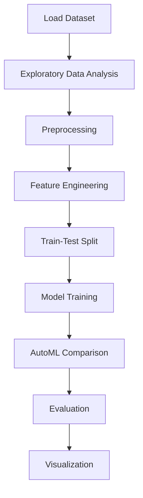

# Student performance prediction


## Project Overview

**Student performance prediction** is a **Classification** project in the **Classification** category.

> Here the dataset have categorical as well as numerical data. Categorical data includes race/ethinicity, parental level of education, lunch, test preparation course while numerical data includes math score, reading score, writing score.

**Target variable:** `writing score`
**Models:** DecisionTree, Lasso, LazyClassifier, LightGBM, LinearRegression, LogisticRegression, PyCaret, Ridge

## Dataset

| Property | Value |
|----------|-------|
| Type | Tabular |
| Source | Local |
| Path | `data/student_performance/StudentsPerformance.csv` |
| Target | `writing score` |

```python
from core.data_loader import load_dataset
df = load_dataset('student_performance_prediction')
```

## Pipeline Files

| File | Lines |
|------|-------|
| `pipeline.py` | 260 |
| `train.py` | 240 |
| `evaluate.py` | 240 |
| `student-performance-explained.ipynb` | 24 code / 12 markdown cells |
| `test_student_performance_prediction.py` | test suite |

## ML Workflow



## Core Logic

### Preprocessing

- Missing value imputation
- One-hot encoding
- StandardScaler normalization
- MinMaxScaler normalization
- Train-test split

### Feature Engineering

Feature engineering steps detected in notebook code cells.

### Visualizations

- Correlation heatmap
- Histograms / distributions
- Scatter plots

## Models

| Model | Type |
|-------|------|
| DecisionTree | Tree-Based |
| Lasso | Regularized Regressor |
| LazyClassifier | AutoML Benchmark (30+ classifiers) |
| LightGBM | Ensemble / Boosting |
| LinearRegression | Linear Regressor |
| LogisticRegression | Linear Classifier |
| PyCaret | AutoML Framework |
| Ridge | Regularized Regressor |

AutoML is toggled via the `USE_AUTOML` flag in pipeline scripts.
**LazyPredict** (`LazyClassifier`) benchmarks 30+ models automatically.
**PyCaret** `compare_models()` runs cross-validated comparison.

## Reproducibility

```python
random.seed(42); np.random.seed(42); os.environ['PYTHONHASHSEED'] = '42'
```

```bash
python pipeline.py --seed 123    # custom seed
python pipeline.py --reproduce   # locked seed=42
```

## Project Structure

```
Classification/Student performance prediction/
  Dataset Link.pdf
  README.md
  Student Performance Prediction.pdf
  evaluate.py
  pipeline.py
  student-performance-explained.ipynb
  test_student_performance_prediction.py
  train.py
```

## How to Run

```bash
cd "Classification/Student performance prediction"
python pipeline.py
python train.py       # training only
python evaluate.py    # evaluation only
```

## Testing

```bash
pytest "Classification/Student performance prediction/test_student_performance_prediction.py" -v
```

## Setup

```bash
pip install lazypredict lightgbm matplotlib numpy pandas pycaret scikit-learn seaborn
```

---
*README auto-generated from `student-performance-explained.ipynb` analysis.*