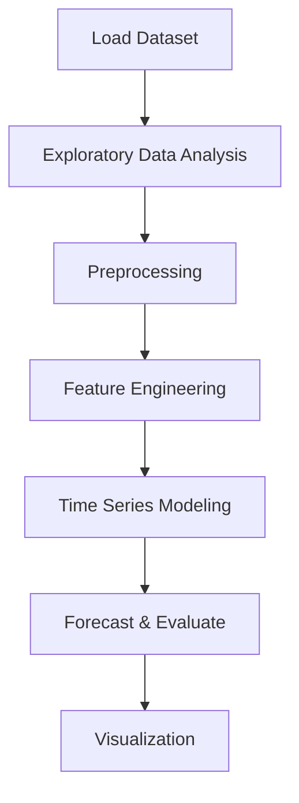

# Traffic Congestion Prediction


## Project Overview

**Traffic Congestion Prediction** is a **Time Series Forecasting** project in the **Classification** category.

> This dataset is a collection of numbers of vehicles at four junctions at an hourly frequency.

**Target variable:** `Vehicles`
**Models:** CNN, LSTM, NeuralNetwork

## Dataset

| Property | Value |
|----------|-------|
| Type | Timeseries |
| Source | Local |
| Path | `data/traffic_congestion_prediction/traffic.csv` |
| Target | `Vehicles` |

```python
from core.data_loader import load_dataset
df = load_dataset('traffic_congestion_prediction')
```

## Pipeline Files

| File | Lines |
|------|-------|
| `pipeline.py` | 319 |
| `traffic_prediction.ipynb` | 17 code / 18 markdown cells |
| `test_traffic_congestion_prediction.py` | test suite |

## ML Workflow



## Core Logic

### Preprocessing

- Missing value imputation
- MinMaxScaler normalization
- Datetime feature extraction

### Feature Engineering

Feature engineering steps detected in notebook code cells.

### Visualizations

- Correlation heatmap
- Count plots
- Pair plots

### Helper Functions

- `Normalize()`
- `Difference()`
- `Stationary_check()`

## Models

| Model | Type |
|-------|------|
| CNN | Neural Network |
| LSTM | Recurrent Neural Network |
| NeuralNetwork | Neural Network |

## Reproducibility

```python
random.seed(42); np.random.seed(42); os.environ['PYTHONHASHSEED'] = '42'
```

```bash
python pipeline.py --seed 123    # custom seed
python pipeline.py --reproduce   # locked seed=42
```

## Project Structure

```
Classification/Traffic Congestion Prediction/
  Dataset Link.pdf
  README.md
  Traffic Congestion Prediction.pdf
  pipeline.py
  test_traffic_congestion_prediction.py
  traffic_prediction.ipynb
```

## How to Run

```bash
cd "Classification/Traffic Congestion Prediction"
python pipeline.py
```

## Testing

```bash
pytest "Classification/Traffic Congestion Prediction/test_traffic_congestion_prediction.py" -v
```

## Setup

```bash
pip install matplotlib numpy pandas scikit-learn seaborn statsmodels tensorflow
```

## Limitations

- Forecast accuracy depends on the train/test split point chosen

---
*README auto-generated from `traffic_prediction.ipynb` analysis.*