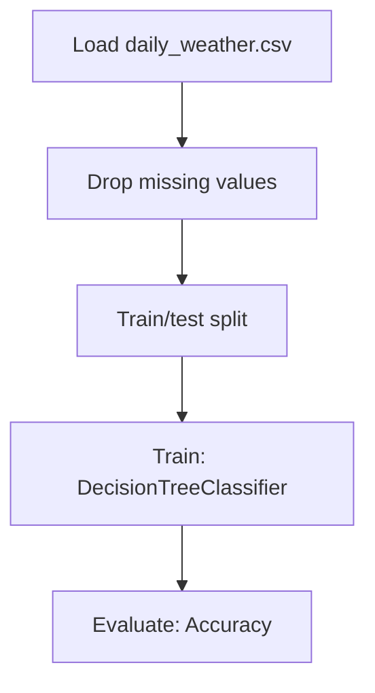

# Weather Data Classification using Decision Trees

## 1. Project Overview

This project implements a **Classification** pipeline for **Weather Data Classification using Decision Trees**.

| Property | Value |
|----------|-------|
| **ML Task** | Classification |
| **Dataset Status** | OK LOCAL |

## 2. Dataset

**Data sources detected in code:**

- `daily_weather.csv`

**Files in project directory:**

- `daily_weather.csv`

**Standardized data path:** `data/weather_data_classification_using_decision_trees/`

## 3. Pipeline Overview

### Original Notebook Pipeline

**Preprocessing:**
- Drop missing values (dropna)
- Train/test split

**Models trained:**
- DecisionTreeClassifier

**Evaluation metrics:**
- Accuracy

## 4. ML Workflow



## 5. Notebook Summary

| Metric | Value |
|--------|-------|
| Total cells | 44 |
| Code cells | 27 |
| Markdown cells | 17 |
| Original models | DecisionTreeClassifier |

## 6. Model Details

### Original Models

- `DecisionTreeClassifier`

### Evaluation Metrics

- Accuracy

## 7. Project Structure

```
Weather Data Classification using Decision Trees/
├── Weather Data Classification using Decision Trees.ipynb
├── daily_weather.csv
└── README.md
```

## 8. Setup & Installation

`pip install -r requirements.txt` from the workspace root.

**Key dependencies:**

- `pandas`
- `scikit-learn`

## 9. How to Run

Open and run the notebook(s) sequentially:

```bash
jupyter notebook
```

- Open `Weather Data Classification using Decision Trees.ipynb` and run all cells

## 10. Testing

Automated tests are available in `tests/test_p128_*.py`:

```bash
python -m pytest tests/test_p128_*.py -v
```

Tests validate data loading and model instantiation.

## 11. Limitations

No significant limitations detected.
