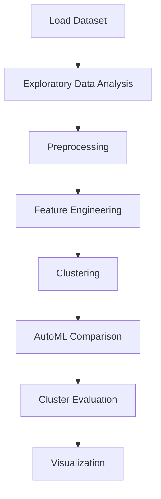

# 2 Credit Card customer segmentation


## Project Overview

**2 Credit Card customer segmentation** is a **Clustering** project in the **Clustering** category.

> Dataset for this notebook consists of credit card usage behavior of customers with 18 behavioral features. Segmentation of customers can be used to define marketing strategies.

**Models:** KMeans, PyCaret

## Dataset

| Property | Value |
|----------|-------|
| Type | Tabular |
| Source | Local |
| Path | `data/credit_card_segmentation/CC GENERAL.csv` |
| Fallback | `manual_required` |

```python
from core.data_loader import load_dataset
df = load_dataset('credit_card_customer_segmentation')
```

## Pipeline Files

| File | Lines |
|------|-------|
| `pipeline.py` | 193 |
| `train.py` | 180 |
| `evaluate.py` | 180 |
| `2 Credit Card customer segmentation.ipynb` | 16 code / 9 markdown cells |
| `test_credit_card_customer_segmentation.py` | test suite |

## ML Workflow



## Core Logic

### Preprocessing

- Missing value imputation
- StandardScaler normalization

### Feature Engineering

Feature engineering steps detected in notebook code cells.

### Visualizations

- Elbow method
- Silhouette analysis

## Models

| Model | Type |
|-------|------|
| KMeans | Centroid Clustering |
| PyCaret | AutoML Framework |

AutoML is toggled via the `USE_AUTOML` flag in pipeline scripts.
**PyCaret** `compare_models()` runs cross-validated comparison.

## Reproducibility

```python
random.seed(42); np.random.seed(42); os.environ['PYTHONHASHSEED'] = '42'
```

```bash
python pipeline.py --seed 123    # custom seed
python pipeline.py --reproduce   # locked seed=42
```

## Project Structure

```
Clustering/2 Credit Card customer segmentation/
  2 Credit Card customer segmentation.docx
  2 Credit Card customer segmentation.ipynb
  Credit Card Customer segmenation.pdf
  README.md
  evaluate.py
  pipeline.py
  test_credit_card_customer_segmentation.py
  train.py
```

## How to Run

```bash
cd "Clustering/2 Credit Card customer segmentation"
python pipeline.py
python train.py       # training only
python evaluate.py    # evaluation only
```

## Testing

```bash
pytest "Clustering/2 Credit Card customer segmentation/test_credit_card_customer_segmentation.py" -v
```

## Setup

```bash
pip install matplotlib numpy pandas pycaret scikit-learn seaborn
```

## Limitations

- Dataset requires manual download — not included in repository

---
*README auto-generated from `2 Credit Card customer segmentation.ipynb` analysis.*