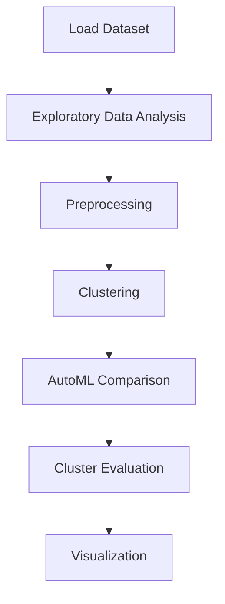

# 1 Customer segmentation for a bank


## Project Overview

**1 Customer segmentation for a bank** is a **Clustering** project in the **Clustering** category.

> It looks that the first column is simply an index which we can delete. Check how many missing values are in each column and of what data types they are.

**Models:** KMeans, PyCaret

## Dataset

| Property | Value |
|----------|-------|
| Type | Tabular |
| Source | Local |
| Path | `data/customer_segmentation_bank/german_credit_data.csv` |
| Fallback | `manual_required` |

```python
from core.data_loader import load_dataset
df = load_dataset('customer_segmentation_for_a_bank')
```

## Pipeline Files

| File | Lines |
|------|-------|
| `pipeline.py` | 240 |
| `train.py` | 209 |
| `evaluate.py` | 209 |
| `1 Customer segmentation for a bank.ipynb` | 29 code / 21 markdown cells |
| `test_customer_segmentation_for_a_bank.py` | test suite |

## ML Workflow



## Core Logic

### Preprocessing

- Missing value imputation
- StandardScaler normalization
- Log transformation

### Visualizations

- Histograms / distributions
- Box plots
- Bar charts
- Scatter plots
- Elbow method
- Silhouette analysis

### Helper Functions

- `scatters()`
- `boxes()`
- `distributions()`

## Models

| Model | Type |
|-------|------|
| KMeans | Centroid Clustering |
| PyCaret | AutoML Framework |

AutoML is toggled via the `USE_AUTOML` flag in pipeline scripts.
**PyCaret** `compare_models()` runs cross-validated comparison.

## Reproducibility

```python
random.seed(42); np.random.seed(42); os.environ['PYTHONHASHSEED'] = '42'
```

```bash
python pipeline.py --seed 123    # custom seed
python pipeline.py --reproduce   # locked seed=42
```

## Project Structure

```
Clustering/1 Customer segmentation for a bank/
  1 Customer segmentation for a bank.docx
  1 Customer segmentation for a bank.ipynb
  Customer Segmentation of a bank.pdf
  README.md
  evaluate.py
  pipeline.py
  test_customer_segmentation_for_a_bank.py
  train.py
```

## How to Run

```bash
cd "Clustering/1 Customer segmentation for a bank"
python pipeline.py
python train.py       # training only
python evaluate.py    # evaluation only
```

## Testing

```bash
pytest "Clustering/1 Customer segmentation for a bank/test_customer_segmentation_for_a_bank.py" -v
```

## Setup

```bash
pip install matplotlib numpy pandas pycaret scikit-learn seaborn
```

## Limitations

- Dataset requires manual download — not included in repository

---
*README auto-generated from `1 Customer segmentation for a bank.ipynb` analysis.*