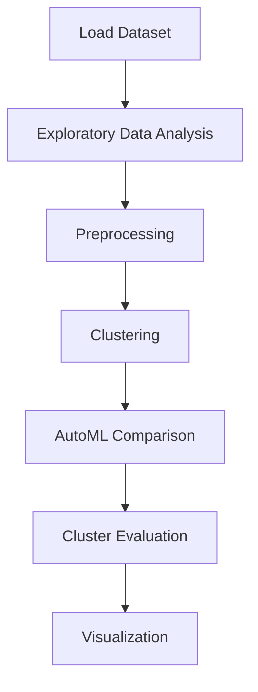

# 9 Clustering financial time series


## Project Overview

**9 Clustering financial time series** is a **Clustering** project in the **Clustering** category.

> Automated clustering pipeline with PyCaret:

**Models:** PyCaret

## Dataset

| Property | Value |
|----------|-------|
| Type | Tabular |
| Source | Local |
| Path | `data/clustering_financial_time_series/all_stocks_5yr.csv` |

```python
from core.data_loader import load_dataset
df = load_dataset('clustering_financial_time_series')
```

## Pipeline Files

| File | Lines |
|------|-------|
| `pipeline.py` | 164 |
| `train.py` | 164 |
| `evaluate.py` | 164 |
| `9 Clustering financial time series.ipynb` | 9 code / 3 markdown cells |
| `test_clustering_financial_time_series.py` | test suite |

## ML Workflow



## Core Logic

### Preprocessing

- Missing value imputation

### Visualizations

- Elbow method
- Silhouette analysis
- ACF / PACF plots

## Models

| Model | Type |
|-------|------|
| PyCaret | AutoML Framework |

AutoML is toggled via the `USE_AUTOML` flag in pipeline scripts.
**PyCaret** `compare_models()` runs cross-validated comparison.

## Reproducibility

```python
random.seed(42); np.random.seed(42); os.environ['PYTHONHASHSEED'] = '42'
```

```bash
python pipeline.py --seed 123    # custom seed
python pipeline.py --reproduce   # locked seed=42
```

## Project Structure

```
Clustering/9 Clustering financial time series/
  9 Clustering financial time series.docx
  9 Clustering financial time series.ipynb
  Clustering Financial time series.pdf
  README.md
  evaluate.py
  pipeline.py
  test_clustering_financial_time_series.py
  train.py
```

## How to Run

```bash
cd "Clustering/9 Clustering financial time series"
python pipeline.py
python train.py       # training only
python evaluate.py    # evaluation only
```

## Testing

```bash
pytest "Clustering/9 Clustering financial time series/test_clustering_financial_time_series.py" -v
```

## Setup

```bash
pip install matplotlib numpy pandas pycaret scikit-learn seaborn
```

---
*README auto-generated from `9 Clustering financial time series.ipynb` analysis.*