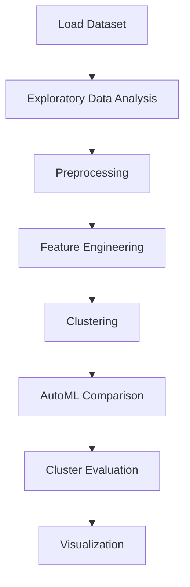

# 6 Housing price segmentation


## Project Overview

**6 Housing price segmentation** is a **Clustering** project in the **Clustering** category.

> Automated clustering pipeline with PyCaret:

**Models:** LinearRegression, PyCaret

## Dataset

| Property | Value |
|----------|-------|
| Type | Tabular |
| Source | Local |
| Path | `data/housing_price_segmentation/House Price India.csv` |

## Pipeline Files

| File | Lines |
|------|-------|
| `pipeline.py` | 154 |
| `train.py` | 131 |
| `evaluate.py` | 154 |
| `6 Housing price segmentation.ipynb` | 8 code / 4 markdown cells |
| `test_housing_price_segmentation.py` | test suite |

## ML Workflow



## Core Logic

### Preprocessing

- Train-test split

### Feature Engineering

Feature engineering steps detected in notebook code cells.

### Visualizations

- Correlation heatmap
- Box plots
- Pair plots
- Scatter plots
- Elbow method
- Silhouette analysis

## Models

| Model | Type |
|-------|------|
| LinearRegression | Linear Regressor |
| PyCaret | AutoML Framework |

AutoML is toggled via the `USE_AUTOML` flag in pipeline scripts.
**PyCaret** `compare_models()` runs cross-validated comparison.

## Reproducibility

```python
random.seed(42); np.random.seed(42); os.environ['PYTHONHASHSEED'] = '42'
```

```bash
python pipeline.py --seed 123    # custom seed
python pipeline.py --reproduce   # locked seed=42
```

## Project Structure

```
Clustering/6 Housing price segmentation/
  6 Housing price segmentation.docx
  6 Housing price segmentation.ipynb
  Housing Price Segmentation.pdf
  README.md
  evaluate.py
  pipeline.py
  test_housing_price_segmentation.py
  train.py
```

## How to Run

```bash
cd "Clustering/6 Housing price segmentation"
python pipeline.py
python train.py       # training only
python evaluate.py    # evaluation only
```

## Testing

```bash
pytest "Clustering/6 Housing price segmentation/test_housing_price_segmentation.py" -v
```

## Setup

```bash
pip install matplotlib numpy pandas pycaret scikit-learn seaborn
```

---
*README auto-generated from `6 Housing price segmentation.ipynb` analysis.*