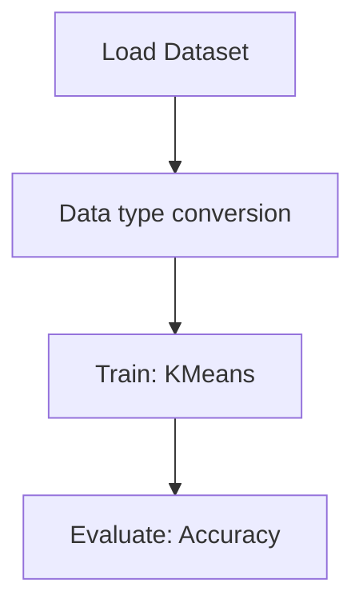

# Clustering - KMeans Clustering for Imagery Analysis

## 1. Project Overview

This project implements a **Clustering** pipeline for **Clustering - KMeans Clustering for Imagery Analysis**.

| Property | Value |
|----------|-------|
| **ML Task** | Clustering |
| **Dataset Status** | DOWNLOADED |

## 2. Dataset

**Standardized data path:** `data/clustering_-_kmeans_clustering_for_imagery_analysis/`

## 3. Pipeline Overview

### Original Notebook Pipeline

**Preprocessing:**
- Data type conversion

**Models trained:**
- KMeans

**Evaluation metrics:**
- Accuracy

## 4. ML Workflow



## 5. Notebook Summary

| Metric | Value |
|--------|-------|
| Total cells | 21 |
| Code cells | 14 |
| Markdown cells | 7 |
| Original models | KMeans |

## 6. Model Details

### Original Models

- `KMeans`

### Evaluation Metrics

- Accuracy

## 7. Project Structure

```
Clustering - KMeans Clustering for Imagery Analysis/
├── KMeans Clustering for Imagery Analysis.ipynb
└── README.md
```

## 8. Setup & Installation

`pip install -r requirements.txt` from the workspace root.

**Key dependencies:**

- `keras`
- `matplotlib`
- `numpy`
- `scikit-learn`

## 9. How to Run

Open and run the notebook(s) sequentially:

```bash
jupyter notebook
```

- Open `KMeans Clustering for Imagery Analysis.ipynb` and run all cells

## 10. Testing

Automated tests are available in `tests/test_p087_*.py`:

```bash
python -m pytest tests/test_p087_*.py -v
```

Tests validate data loading and model instantiation.

## 11. Limitations

No significant limitations detected.
