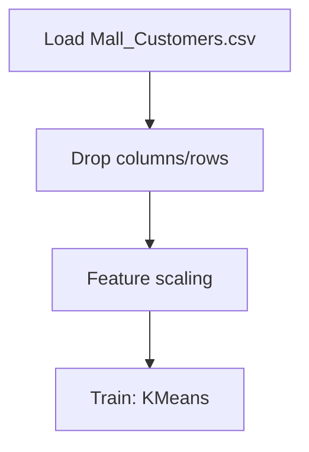

# Clustering -Mall Customer Segmentation

## 1. Project Overview

This project implements a **Clustering** pipeline for **Clustering -Mall Customer Segmentation**.

| Property | Value |
|----------|-------|
| **ML Task** | Clustering |
| **Dataset Status** | OK LOCAL |

## 2. Dataset

**Data sources detected in code:**

- `Mall_Customers.csv`

**Files in project directory:**

- `Mall_Customers.csv`

**Standardized data path:** `data/clustering_-mall_customer_segmentation/`

## 3. Pipeline Overview

### Original Notebook Pipeline

**Preprocessing:**
- Drop columns/rows
- Feature scaling (StandardScaler)

**Models trained:**
- KMeans

## 4. ML Workflow



## 5. Notebook Summary

| Metric | Value |
|--------|-------|
| Total cells | 44 |
| Code cells | 26 |
| Markdown cells | 18 |
| Original models | KMeans |

## 6. Model Details

### Original Models

- `KMeans`

## 7. Project Structure

```
Clustering -Mall Customer Segmentation/
├── Mall Customer Segmentation.ipynb
├── Mall_Customers.csv
└── README.md
```

## 8. Setup & Installation

`pip install -r requirements.txt` from the workspace root.

**Key dependencies:**

- `matplotlib`
- `numpy`
- `pandas`
- `scikit-learn`
- `seaborn`

## 9. How to Run

Open and run the notebook(s) sequentially:

```bash
jupyter notebook
```

- Open `Mall Customer Segmentation.ipynb` and run all cells

## 10. Testing

Automated tests are available in `tests/test_p086_*.py`:

```bash
python -m pytest tests/test_p086_*.py -v
```

Tests validate data loading and model instantiation.

## 11. Limitations

- No evaluation metrics found in original code
