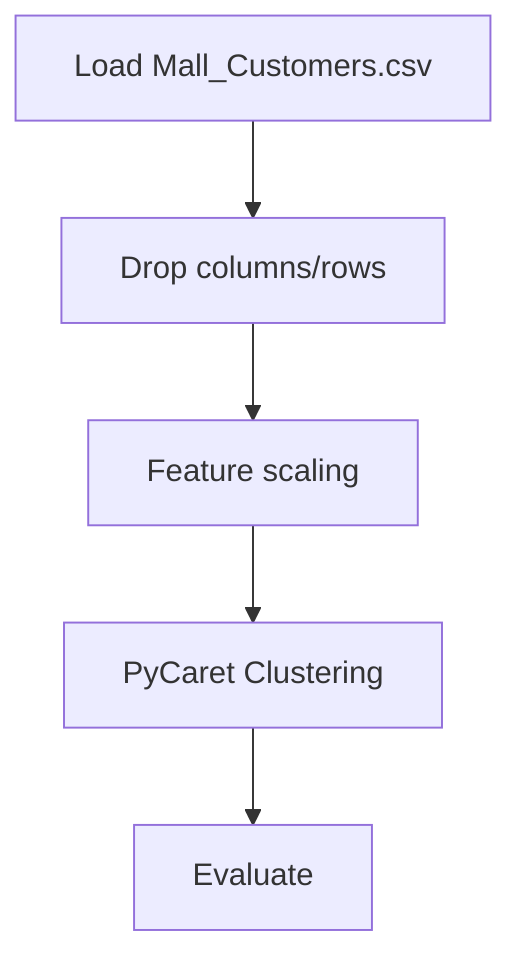

# Mall Customer Segmentation

## 1. Project Overview

This project implements a **Clustering** pipeline for **Mall Customer Segmentation**.

| Property | Value |
|----------|-------|
| **ML Task** | Clustering |
| **Dataset Status** | OK LOCAL |
| **Standardized Pipeline** | Yes (PyCaret) |

## 2. Dataset

**Data sources detected in code:**

- `Mall_Customers.csv`

**Files in project directory:**

- `Mall_Customers.csv`

**Standardized data path:** `data/mall_customer_segmentation/`

## 3. Pipeline Overview

### Original Notebook Pipeline

**Preprocessing:**
- Drop columns/rows
- Feature scaling (StandardScaler)

### Standardized Pipeline (added)

- **PyCaret Clustering**: Full AutoML pipeline (setup → compare → tune → evaluate → finalize)

## 4. ML Workflow



## 5. Notebook Summary

| Metric | Value |
|--------|-------|
| Total cells | 47 |
| Code cells | 28 |
| Markdown cells | 19 |
| Original cells | 35 |
| Standardized cells (added) | 12 |
| Original model training | None — preprocessing/EDA only |

## 6. Model Details

### PyCaret Clustering (Standardized)

AutoML pipeline: `setup()` → `compare_models()` → `tune_model()` → `finalize_model()`

> ⚠️ Requires Python ≤ 3.11.

### Evaluation Metrics

- Silhouette Score

## 7. Project Structure

```
Mall Customer Segmentation/
├── Mall Customer Segmentation.ipynb
├── Mall_Customers.csv
├── Mall Customer Segmentation - PPT.pdf
├── Mall Customer Segmentation - Report.pdf
└── README.md
```

## 8. Setup & Installation

`pip install -r requirements.txt` from the workspace root.

**Key dependencies:**

- `matplotlib`
- `numpy`
- `pandas`
- `pycaret`
- `scikit-learn`
- `seaborn`

## 9. How to Run

Open and run the notebook(s) sequentially:

```bash
jupyter notebook
```

- Open `Mall Customer Segmentation.ipynb` and run all cells

## 10. Testing

Automated tests are available in `tests/test_p067_*.py`:

```bash
python -m pytest tests/test_p067_*.py -v
```

Tests validate data loading and library imports.

## 11. Limitations

- PyCaret cells require Python ≤ 3.11 — they will fail on Python 3.12+
- No original model training exists — only auto-generated LazyPredict/PyCaret cells

## 12. Cleanup Notes

Cells added during workspace standardization:

- **PyCaret Clustering** pipeline cell
