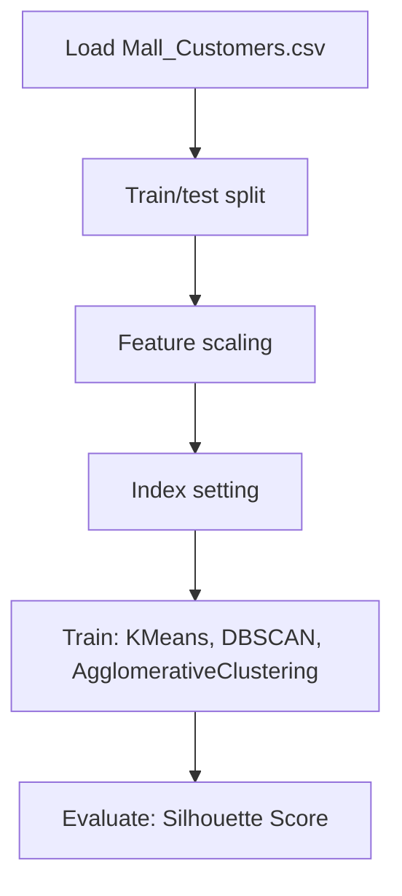

# Mall Customer Segmentation Data

## 1. Project Overview

This project implements a **Clustering** pipeline for **Mall Customer Segmentation Data**.

| Property | Value |
|----------|-------|
| **ML Task** | Clustering |
| **Dataset Status** | OK LOCAL |

## 2. Dataset

**Data sources detected in code:**

- `Mall_Customers.csv`

**Files in project directory:**

- `Mall_Customers.csv`

**Standardized data path:** `data/mall_customer_segmentation_data/`

## 3. Pipeline Overview

### Original Notebook Pipeline

**Preprocessing:**
- Train/test split
- Feature scaling (MinMaxScaler)
- Index setting

**Models trained:**
- KMeans
- DBSCAN
- AgglomerativeClustering

**Evaluation metrics:**
- Silhouette Score

## 4. ML Workflow



## 5. Notebook Summary

| Metric | Value |
|--------|-------|
| Total cells | 45 |
| Code cells | 45 |
| Markdown cells | 0 |
| Original models | KMeans, DBSCAN, AgglomerativeClustering |

**⚠️ Deprecated APIs detected:**

- `sns.distplot()` is deprecated — use `sns.displot()` or `sns.histplot()`

## 6. Model Details

### Original Models

- `KMeans`
- `DBSCAN`
- `AgglomerativeClustering`

### Evaluation Metrics

- Silhouette Score

## 7. Project Structure

```
Mall Customer Segmentation Data/
├── customer-insights-kmeans-gaussian(1).ipynb
├── Mall_Customers.csv
├── link_to_dataset
└── README.md
```

## 8. Setup & Installation

`pip install -r requirements.txt` from the workspace root.

**Key dependencies:**

- `matplotlib`
- `numpy`
- `pandas`
- `plotly`
- `scikit-learn`
- `scipy`
- `seaborn`

## 9. How to Run

Open and run the notebook(s) sequentially:

```bash
jupyter notebook
```

- Open `customer-insights-kmeans-gaussian(1).ipynb` and run all cells

## 10. Testing

Automated tests are available in `tests/test_p080_*.py`:

```bash
python -m pytest tests/test_p080_*.py -v
```

Tests validate data loading and model instantiation.

## 11. Limitations

- `sns.distplot()` is deprecated — use `sns.displot()` or `sns.histplot()`
