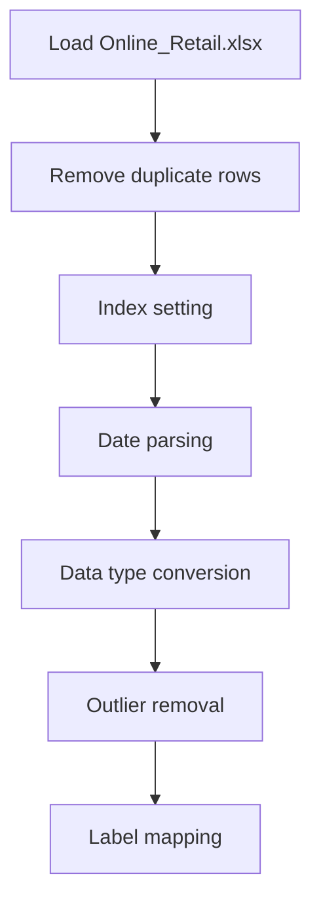

# Customer_Segmentation_Online_Retail

## 1. Project Overview

This project implements a **Clustering** pipeline for **Customer_Segmentation_Online_Retail**.

| Property | Value |
|----------|-------|
| **ML Task** | Clustering |
| **Dataset Status** | OK LOCAL |

## 2. Dataset

**Data sources detected in code:**

- `Online_Retail.xlsx`

**Files in project directory:**

- `Online Retail.xlsx`

**Standardized data path:** `data/customer_segmentation_online_retail/`

## 3. Pipeline Overview

### Original Notebook Pipeline

**Preprocessing:**
- Remove duplicate rows
- Index setting
- Date parsing
- Data type conversion
- Outlier removal (IQR/quantile)
- Label mapping (function)

## 4. ML Workflow



## 5. Notebook Summary

| Metric | Value |
|--------|-------|
| Total cells | 56 |
| Code cells | 32 |
| Markdown cells | 24 |

## 6. Model Details

No model training in this project.

## 7. Project Structure

```
Customer_Segmentation_Online_Retail/
├── Customer_Segmentation_Online_Retail.ipynb
├── Online Retail.xlsx
└── README.md
```

## 8. Setup & Installation

`pip install -r requirements.txt` from the workspace root.

**Key dependencies:**

- `pandas`

## 9. How to Run

Open and run the notebook(s) sequentially:

```bash
jupyter notebook
```

- Open `Customer_Segmentation_Online_Retail.ipynb` and run all cells

## 10. Testing

Automated tests are available in `tests/test_p138_*.py`:

```bash
python -m pytest tests/test_p138_*.py -v
```

Tests validate data loading and library imports.

## 11. Limitations

- No model training — this is an analysis/tutorial notebook only
