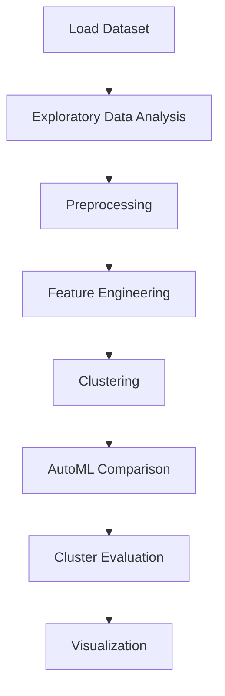

# 7 spotify song cluster analysis


## Project Overview

**7 spotify song cluster analysis** is a **Clustering** project in the **Clustering** category.

> As you can see above, while there is an negative relationship between Energy and Acousticness, there is a positive relationship between Energy and Loudness.

**Target variable:** `Unnamed: 0`
**Models:** PyCaret

## Dataset

| Property | Value |
|----------|-------|
| Type | Tabular |
| Source | Local |
| Path | `data/spotify_song_cluster/top50.csv` |
| Target | `Unnamed: 0` |

```python
from core.data_loader import load_dataset
df = load_dataset('spotify_song_cluster_analysis')
```

## Pipeline Files

| File | Lines |
|------|-------|
| `pipeline.py` | 478 |
| `train.py` | 403 |
| `evaluate.py` | 403 |
| `7 spotify song cluster analysis.ipynb` | 39 code / 5 markdown cells |
| `test_spotify_song_cluster_analysis.py` | test suite |

## ML Workflow



## Core Logic

### Preprocessing

- Missing value imputation
- StandardScaler normalization
- Train-test split

### Feature Engineering

Feature engineering steps detected in notebook code cells.

### Visualizations

- Correlation heatmap
- Histograms / distributions
- Bar charts
- Scatter plots
- Elbow method
- Silhouette analysis

## Models

| Model | Type |
|-------|------|
| PyCaret | AutoML Framework |

AutoML is toggled via the `USE_AUTOML` flag in pipeline scripts.
**PyCaret** `compare_models()` runs cross-validated comparison.

## Reproducibility

```python
random.seed(42); np.random.seed(42); os.environ['PYTHONHASHSEED'] = '42'
```

```bash
python pipeline.py --seed 123    # custom seed
python pipeline.py --reproduce   # locked seed=42
```

## Project Structure

```
Clustering/7 spotify song cluster analysis/
  7 spotify song cluster analysis.docx
  7 spotify song cluster analysis.ipynb
  README.md
  Spotify song clustring analysis.pdf
  evaluate.py
  pipeline.py
  test_spotify_song_cluster_analysis.py
  train.py
```

## How to Run

```bash
cd "Clustering/7 spotify song cluster analysis"
python pipeline.py
python train.py       # training only
python evaluate.py    # evaluation only
```

## Testing

```bash
pytest "Clustering/7 spotify song cluster analysis/test_spotify_song_cluster_analysis.py" -v
```

## Setup

```bash
pip install matplotlib numpy pandas pycaret scikit-learn seaborn
```

---
*README auto-generated from `7 spotify song cluster analysis.ipynb` analysis.*