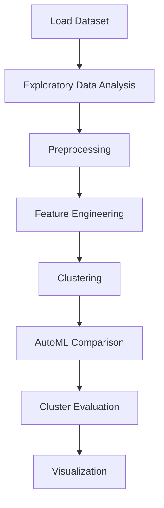

# 10 clustering vehicle crash data for safety analysi


## Project Overview

**10 clustering vehicle crash data for safety analysi** is a **Clustering** project in the **Clustering** category.

> Since there are so many categorical values, we need to use feature selection

**Models:** LazyClassifier, PyCaret

## Dataset

| Property | Value |
|----------|-------|
| Type | Tabular |
| Source | Local |
| Path | `data/vehicle_crash_clustering/RTA Dataset.csv` |
| Fallback | `manual_required` |

```python
from core.data_loader import load_dataset
df = load_dataset('clustering_vehicle_crash_data_for_safety_analysi')
```

## Pipeline Files

| File | Lines |
|------|-------|
| `pipeline.py` | 404 |
| `train.py` | 278 |
| `evaluate.py` | 278 |
| `10 Clustering vehicle crash data.ipynb` | 53 code / 15 markdown cells |
| `test_clustering_vehicle_crash_data_for_safety_analysi.py` | test suite |

## ML Workflow



## Core Logic

### Preprocessing

- Missing value imputation
- Label encoding
- One-hot encoding
- SMOTE oversampling
- Train-test split

### Feature Engineering

Feature engineering steps detected in notebook code cells.

### Visualizations

- Correlation heatmap
- Histograms / distributions
- Count plots
- Scatter plots

## Models

| Model | Type |
|-------|------|
| LazyClassifier | AutoML Benchmark (30+ classifiers) |
| PyCaret | AutoML Framework |

AutoML is toggled via the `USE_AUTOML` flag in pipeline scripts.
**LazyPredict** (`LazyClassifier`) benchmarks 30+ models automatically.
**PyCaret** `compare_models()` runs cross-validated comparison.

## Reproducibility

```python
random.seed(42); np.random.seed(42); os.environ['PYTHONHASHSEED'] = '42'
```

```bash
python pipeline.py --seed 123    # custom seed
python pipeline.py --reproduce   # locked seed=42
```

## Project Structure

```
Clustering/10 clustering vehicle crash data for safety analysi/
  10 Clustering vehicle crash data.docx
  10 Clustering vehicle crash data.ipynb
  Clustering vehicle crash data.pdf
  README.md
  evaluate.py
  pipeline.py
  test_clustering_vehicle_crash_data_for_safety_analysi.py
  train.py
```

## How to Run

```bash
cd "Clustering/10 clustering vehicle crash data for safety analysi"
python pipeline.py
python train.py       # training only
python evaluate.py    # evaluation only
```

## Testing

```bash
pytest "Clustering/10 clustering vehicle crash data for safety analysi/test_clustering_vehicle_crash_data_for_safety_analysi.py" -v
```

## Setup

```bash
pip install lazypredict matplotlib numpy pandas pycaret scikit-learn seaborn
```

## Limitations

- Dataset requires manual download — not included in repository

---
*README auto-generated from `10 Clustering vehicle crash data.ipynb` analysis.*