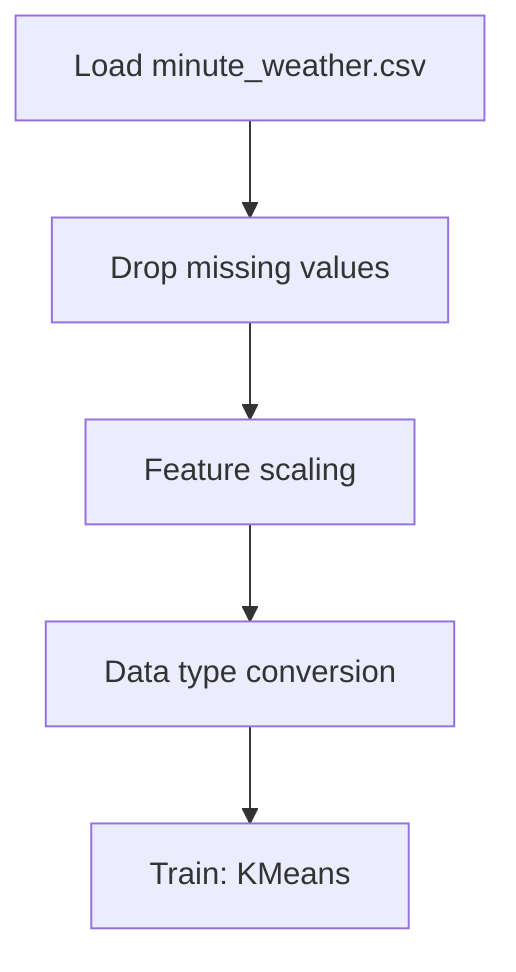

# Weather Data Clustering using k-Means

## 1. Project Overview

This project implements a **Clustering** pipeline for **Weather Data Clustering using k-Means**.

| Property | Value |
|----------|-------|
| **ML Task** | Clustering |
| **Dataset Status** | BLOCKED LINK ONLY |

## 2. Dataset

**Data sources detected in code:**

- `minute_weather.csv`

> ⚠️ **Dataset not available locally.** Link-only but no downloadable URL identified

## 3. Pipeline Overview

### Original Notebook Pipeline

**Preprocessing:**
- Drop missing values (dropna)
- Feature scaling (StandardScaler)
- Data type conversion

**Models trained:**
- KMeans

## 4. ML Workflow



## 5. Notebook Summary

| Metric | Value |
|--------|-------|
| Total cells | 43 |
| Code cells | 25 |
| Markdown cells | 18 |
| Original models | KMeans |

## 6. Model Details

### Original Models

- `KMeans`

## 7. Project Structure

```
Weather Data Clustering using k-Means/
├── Weather Data Clustering using k-Means.ipynb
└── README.md
```

## 8. Setup & Installation

`pip install -r requirements.txt` from the workspace root.

**Key dependencies:**

- `matplotlib`
- `numpy`
- `pandas`
- `scikit-learn`

## 9. How to Run

Open and run the notebook(s) sequentially:

```bash
jupyter notebook
```

- Open `Weather Data Clustering using k-Means.ipynb` and run all cells

## 10. Testing

Automated tests are available in `tests/test_p129_*.py`:

```bash
python -m pytest tests/test_p129_*.py -v
```

Tests validate data loading and model instantiation.

## 11. Limitations

- Dataset is not available locally — notebook cannot run without manual data setup
- No evaluation metrics found in original code
