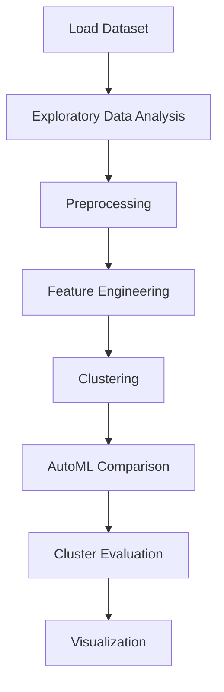

# 8 wholesale customer segmentation


## Project Overview

**8 wholesale customer segmentation** is a **Clustering** project in the **Clustering** category.

> We can clearly see that the data is not scaled and not normally distributed. We will examine thus further ahead.

**Models:** AgglomerativeClustering, KMeans, PyCaret

## Dataset

| Property | Value |
|----------|-------|
| Type | Tabular |
| Source | Local |
| Path | `data/wholesale_customer_segmentation/Wholesale customers data.csv` |

```python
from core.data_loader import load_dataset
df = load_dataset('wholesale_customer_segmentation')
```

## Pipeline Files

| File | Lines |
|------|-------|
| `pipeline.py` | 251 |
| `train.py` | 172 |
| `evaluate.py` | 172 |
| `8 Wholesale customer segmentation.ipynb` | 24 code / 14 markdown cells |
| `test_wholesale_customer_segmentation.py` | test suite |

## ML Workflow



## Core Logic

### Preprocessing

- Missing value imputation
- One-hot encoding
- MinMaxScaler normalization
- Outlier removal

### Feature Engineering

Feature engineering steps detected in notebook code cells.

### Visualizations

- Histograms / distributions
- Box plots
- Elbow method
- Silhouette analysis
- Dendrogram

## Models

| Model | Type |
|-------|------|
| AgglomerativeClustering | Hierarchical Clustering |
| KMeans | Centroid Clustering |
| PyCaret | AutoML Framework |

AutoML is toggled via the `USE_AUTOML` flag in pipeline scripts.
**PyCaret** `compare_models()` runs cross-validated comparison.

## Reproducibility

```python
random.seed(42); np.random.seed(42); os.environ['PYTHONHASHSEED'] = '42'
```

```bash
python pipeline.py --seed 123    # custom seed
python pipeline.py --reproduce   # locked seed=42
```

## Project Structure

```
Clustering/8 wholesale customer segmentation/
  8 Wholesale customer segmentation.docx
  8 Wholesale customer segmentation.ipynb
  README.md
  Wholesale customer segmentation.pdf
  evaluate.py
  pipeline.py
  test_wholesale_customer_segmentation.py
  train.py
```

## How to Run

```bash
cd "Clustering/8 wholesale customer segmentation"
python pipeline.py
python train.py       # training only
python evaluate.py    # evaluation only
```

## Testing

```bash
pytest "Clustering/8 wholesale customer segmentation/test_wholesale_customer_segmentation.py" -v
```

## Setup

```bash
pip install matplotlib numpy pandas pycaret scikit-learn seaborn
```

---
*README auto-generated from `8 Wholesale customer segmentation.ipynb` analysis.*