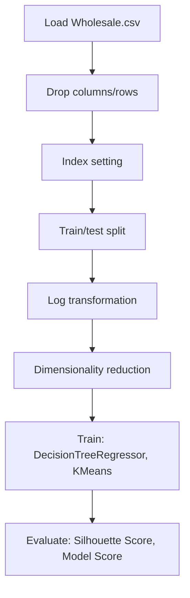

# Customer_Segmentation_Whosale

## 1. Project Overview

This project implements a **Clustering** pipeline for **Customer_Segmentation_Whosale**.

| Property | Value |
|----------|-------|
| **ML Task** | Clustering |
| **Dataset Status** | OK LOCAL |

## 2. Dataset

**Data sources detected in code:**

- `Wholesale.csv`

**Files in project directory:**

- `Wholesale customers data.csv`

**Standardized data path:** `data/customer_segmentation_whosale/`

## 3. Pipeline Overview

### Original Notebook Pipeline

**Preprocessing:**
- Drop columns/rows
- Index setting
- Train/test split
- Log transformation
- Dimensionality reduction (PCA)

**Models trained:**
- DecisionTreeRegressor
- KMeans

**Evaluation metrics:**
- Silhouette Score
- Model Score

## 4. ML Workflow



## 5. Notebook Summary

| Metric | Value |
|--------|-------|
| Total cells | 71 |
| Code cells | 34 |
| Markdown cells | 37 |
| Original models | DecisionTreeRegressor, KMeans |

**⚠️ Deprecated APIs detected:**

- `sklearn.cross_validation` removed — use `sklearn.model_selection`

## 6. Model Details

### Original Models

- `DecisionTreeRegressor`
- `KMeans`

### Evaluation Metrics

- Silhouette Score
- Model Score

## 7. Project Structure

```
Customer_Segmentation_Whosale/
├── Customer_Segmentation_Whosale.ipynb
├── Wholesale customers data.csv
└── README.md
```

## 8. Setup & Installation

`pip install -r requirements.txt` from the workspace root.

**Key dependencies:**

- `matplotlib`
- `numpy`
- `pandas`
- `scikit-learn`
- `scipy`
- `seaborn`

## 9. How to Run

Open and run the notebook(s) sequentially:

```bash
jupyter notebook
```

- Open `Customer_Segmentation_Whosale.ipynb` and run all cells

## 10. Testing

Automated tests are available in `tests/test_p139_*.py`:

```bash
python -m pytest tests/test_p139_*.py -v
```

Tests validate data loading and model instantiation.

## 11. Limitations

- `sklearn.cross_validation` removed — use `sklearn.model_selection`
