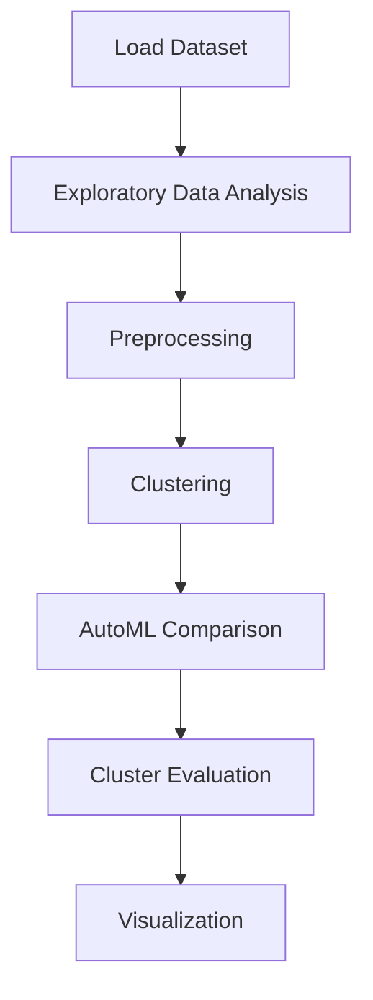

# 5 Wine segmentation


## Project Overview

**5 Wine segmentation** is a **Clustering** project in the **Clustering** category.

> Quick automated comparison of multiple models to establish baselines.

**Target variable:** `Customer_Segment`
**Models:** LazyClassifier, PyCaret

## Dataset

| Property | Value |
|----------|-------|
| Type | Tabular |
| Source | Local |
| Path | `data/wine_segmentation/wine-clustering.csv` |
| Target | `Customer_Segment` |

```python
from core.data_loader import load_dataset
df = load_dataset('wine_segmentation')
```

## Pipeline Files

| File | Lines |
|------|-------|
| `pipeline.py` | 183 |
| `train.py` | 158 |
| `evaluate.py` | 158 |
| `5 Wine segmentation.ipynb` | 16 code / 13 markdown cells |
| `test_wine_segmentation.py` | test suite |

## ML Workflow



## Core Logic

### Preprocessing

- StandardScaler normalization
- Train-test split

### Visualizations

- Correlation heatmap
- Scatter plots
- Confusion matrix

## Models

| Model | Type |
|-------|------|
| LazyClassifier | AutoML Benchmark (30+ classifiers) |
| PyCaret | AutoML Framework |

AutoML is toggled via the `USE_AUTOML` flag in pipeline scripts.
**LazyPredict** (`LazyClassifier`) benchmarks 30+ models automatically.
**PyCaret** `compare_models()` runs cross-validated comparison.

## Reproducibility

```python
random.seed(42); np.random.seed(42); os.environ['PYTHONHASHSEED'] = '42'
```

```bash
python pipeline.py --seed 123    # custom seed
python pipeline.py --reproduce   # locked seed=42
```

## Project Structure

```
Clustering/5 Wine segmentation/
  5 Wine segmentation.docx
  5 Wine segmentation.ipynb
  README.md
  Wine segmentation.pdf
  evaluate.py
  pipeline.py
  test_wine_segmentation.py
  train.py
```

## How to Run

```bash
cd "Clustering/5 Wine segmentation"
python pipeline.py
python train.py       # training only
python evaluate.py    # evaluation only
```

## Testing

```bash
pytest "Clustering/5 Wine segmentation/test_wine_segmentation.py" -v
```

## Setup

```bash
pip install lazypredict matplotlib numpy pandas pycaret scikit-learn seaborn
```

---
*README auto-generated from `5 Wine segmentation.ipynb` analysis.*