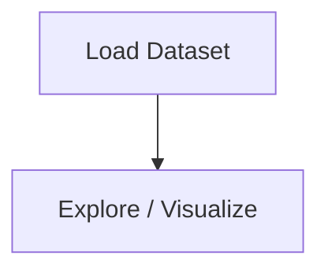

# Car And Pedestrain Tracker

## 1. Project Overview

This project implements a **Exploratory Data Analysis** pipeline for **Car And Pedestrain Tracker**.

| Property | Value |
|----------|-------|
| **ML Task** | Exploratory Data Analysis |
| **Dataset Status** | OK LOCAL |

## 2. Dataset

**Standardized data path:** `data/car_and_pedestrain_tracker/`

## 3. Pipeline Overview

The original notebook primarily contains data loading and exploratory data analysis.

## 4. ML Workflow



## 5. Notebook Summary

| Metric | Value |
|--------|-------|
| Total cells | 0 |
| Code cells | 0 |
| Markdown cells | 0 |

## 6. Model Details

No model training in this project.

## 7. Project Structure

```
Car And Pedestrain Tracker/
├── Car_And_Pedestrain_Tracker.py
├── Car_Image.jpg
├── cars.xml
├── haarcascade_fullbody.xml
├── pedestrain.mp4
└── README.md
```

## 8. Setup & Installation

`pip install -r requirements.txt` from the workspace root.

**Key dependencies:**

- `opencv-python`

## 9. How to Run

Run the Python script(s):

```bash
python "Car_And_Pedestrain_Tracker.py"
```

## 10. Testing

Automated tests are available in `tests/test_p047_*.py`:

```bash
python -m pytest tests/test_p047_*.py -v
```

Tests validate data loading and library imports.

## 11. Limitations

- No model training — this is an analysis/tutorial notebook only
- Hardcoded file paths detected — may need adjustment
