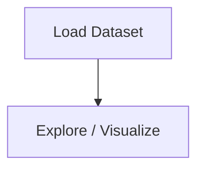

# Face Detection (OpenCV) - Computer Vision

## 1. Project Overview

This project implements a **Classification** pipeline for **Face Detection (OpenCV) - Computer Vision**.

| Property | Value |
|----------|-------|
| **ML Task** | Classification |
| **Dataset Status** | OK LOCAL |

## 2. Dataset

**Standardized data path:** `data/face_detection_opencv_-_computer_vision/`

## 3. Pipeline Overview

The original notebook primarily contains data loading and exploratory data analysis.

## 4. ML Workflow



## 5. Notebook Summary

| Metric | Value |
|--------|-------|
| Total cells | 14 |
| Code cells | 10 |
| Markdown cells | 4 |

## 6. Model Details

No model training in this project.

## 7. Project Structure

```
Face Detection (OpenCV) - Computer Vision/
├── Face Detection (OpenCV) - Computer Vision.ipynb
├── haarcascade_frontalface_default.xml
├── test image.jpg
└── README.md
```

## 8. Setup & Installation

`pip install -r requirements.txt` from the workspace root.

**Key dependencies:**

- `matplotlib`
- `opencv-python`

## 9. How to Run

Open and run the notebook(s) sequentially:

```bash
jupyter notebook
```

- Open `Face Detection (OpenCV) - Computer Vision.ipynb` and run all cells

## 10. Testing

Automated tests are available in `tests/test_p059_*.py`:

```bash
python -m pytest tests/test_p059_*.py -v
```

Tests validate data loading and library imports.

## 11. Limitations

- No model training — this is an analysis/tutorial notebook only
