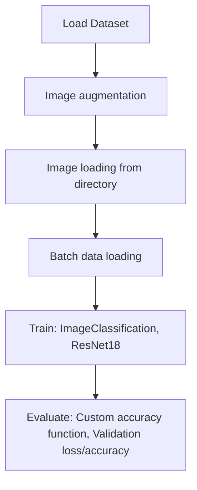

# Face Expression Identifier

## 1. Project Overview

This project implements a **Computer Vision** pipeline for **Face Expression Identifier**.

| Property | Value |
|----------|-------|
| **ML Task** | Computer Vision |
| **Dataset Status** | BLOCKED KAGGLE |

## 2. Dataset

> ⚠️ **Dataset not available locally.** kaggle: manishshah120/facial-expression-recog-image-ver-of-fercdataset

## 3. Pipeline Overview

### Original Notebook Pipeline

**Preprocessing:**
- Image augmentation
- Image loading from directory (ImageFolder)
- Batch data loading (DataLoader)

**Models trained:**
- ImageClassification (Custom PyTorch)
- ResNet18 (pretrained)

**Evaluation metrics:**
- Custom accuracy function
- Validation loss/accuracy
- Training loss tracking

## 4. ML Workflow



## 5. Notebook Summary

| Metric | Value |
|--------|-------|
| Total cells | 30 |
| Code cells | 29 |
| Markdown cells | 1 |
| Original models | ImageClassification, ResNet18 |

## 6. Model Details

### Original Models

- `ImageClassification (Custom PyTorch)`
- `ResNet18 (pretrained)`

### Evaluation Metrics

- Custom accuracy function
- Validation loss/accuracy
- Training loss tracking

## 7. Project Structure

```
Face Expression Identifier/
├── face-exp-resnet.ipynb
└── README.md
```

## 8. Setup & Installation

`pip install -r requirements.txt` from the workspace root.

**Key dependencies:**

- `Pillow`
- `matplotlib`
- `numpy`
- `torch`
- `torchvision`

## 9. How to Run

Open and run the notebook(s) sequentially:

```bash
jupyter notebook
```

- Open `face-exp-resnet.ipynb` and run all cells

## 10. Testing

Automated tests are available in `tests/test_p021_*.py`:

```bash
python -m pytest tests/test_p021_*.py -v
```

Tests validate data loading and model instantiation.

## 11. Limitations

- Dataset is not available locally — notebook cannot run without manual data setup
