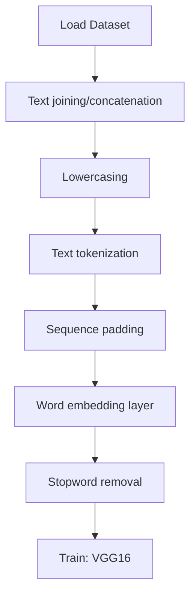

# Image_Caption_Project

## 1. Project Overview

This project implements a **Computer Vision** pipeline for **Image_Caption_Project**.

| Property | Value |
|----------|-------|
| **ML Task** | Computer Vision |
| **Dataset Status** | OK LOCAL |

## 2. Dataset

## 3. Pipeline Overview

### Original Notebook Pipeline

**Preprocessing:**
- Text joining/concatenation
- Lowercasing
- Text tokenization (Keras)
- Sequence padding
- Word embedding layer
- Stopword removal

**Models trained:**
- VGG16 (pretrained)

## 4. ML Workflow



## 5. Notebook Summary

| Metric | Value |
|--------|-------|
| Total cells | 11 |
| Code cells | 11 |
| Markdown cells | 0 |
| Original models | VGG16 |

## 6. Model Details

### Original Models

- `VGG16 (pretrained)`

**Neural network architecture:**

```
  LSTM(256)
  Dense(256)
  Dropout(0.5)
  Embedding
```

## 7. Project Structure

```
Image_Caption_Project/
├── Image_caption_Project.ipynb
├── image_caption_project.py
└── README.md
```

## 8. Setup & Installation

`pip install -r requirements.txt` from the workspace root.

**Key dependencies:**

- `keras`
- `nltk`
- `numpy`
- `tensorflow`

## 9. How to Run

Open and run the notebook(s) sequentially:

```bash
jupyter notebook
```

- Open `Image_caption_Project.ipynb` and run all cells

Run the Python script(s):

```bash
python "image_caption_project.py"
```

## 10. Testing

Automated tests are available in `tests/test_p150_*.py`:

```bash
python -m pytest tests/test_p150_*.py -v
```

Tests validate data loading and model instantiation.

## 11. Limitations

- No train/test split detected in code
- No evaluation metrics found in original code
