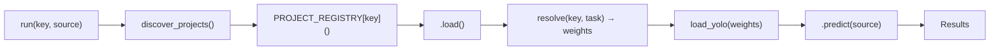
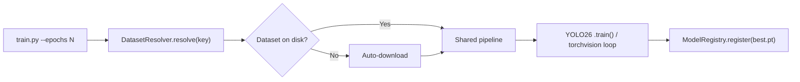

<!-- README.md — Computer Vision Projects -->

<div align="center">

# Computer Vision Projects

**A production-grade collection of 73 computer vision projects unified under a modular Python framework.**

[](https://python.org)
[](https://pytorch.org)
[](https://docs.ultralytics.com)
[](https://opencv.org)
[](#license)

Detection · Classification · Segmentation · Pose & Landmarks · Face Analysis · OCR · Tracking · Image Processing

[Getting Started](#getting-started) · [Architecture](#architecture) · [Project Catalog](#project-catalog) · [Training](#training) · [Benchmarks](#benchmarks)

</div>

---

## Overview

This repository provides 73 end-to-end computer vision projects — spanning object detection, image classification, semantic segmentation, pose estimation, real-time tracking, and classical image processing — built on a shared framework that enforces consistent patterns across every project.

Each project implements a `modern.py` module that subclasses the `CVProject` abstract base class, registers itself in a central `PROJECT_REGISTRY`, and resolves model weights at runtime through a unified `ModelRegistry`. This design enables any project to be loaded, run, trained, and benchmarked with a single API.

### Key Features

- **Unified API** — Every project follows the same `load() → predict() → visualize()` lifecycle
- **Model Registry** — Automatic weight resolution with custom-trained model priority over pretrained defaults
- **Auto-Download** — Six dataset download handlers (HTTP/ZIP, TAR, Kaggle, Google Drive, Git, manual) driven by YAML configs
- **Shared Training Pipelines** — Four reusable training scripts (detection, classification, segmentation, pose) with auto-registration of trained weights
- **Benchmarking Suite** — Latency and accuracy evaluation with zero-skip policy and CI-safe dry-run mode
- **Validation** — 73 structural checks + 178 CI-level checks ensure project health

---

## Getting Started

### Prerequisites

- Python >= 3.11
- CUDA-capable GPU (recommended; CPU fallback supported)

### Installation

```bash
git clone https://github.com/pypi-ahmad/Computer-Vision-Projects.git
cd Computer-Vision-Projects
```

**Automated setup** (installs dependencies, configures PyTorch+CUDA, sets up git hooks):

```powershell
# Windows (PowerShell)
.\scripts\setup_env.ps1

# Linux / macOS
chmod +x scripts/setup_env.sh && ./scripts/setup_env.sh
```

**Manual setup:**

```bash
pip install -r requirements.txt
pip3 install torch torchvision --index-url https://download.pytorch.org/whl/cu130
```

### Verify Installation

```bash
python scripts/smoke_test.py     # 73 structural checks
python scripts/ci_sanity.py      # 178 CI-level checks
```

### Run a Project

```python
from core import discover_projects, run

discover_projects()
result = run("face_mask_detection", "path/to/image.jpg")
```

---

## Architecture

The framework is organized around four layers: a core engine, per-project implementations, shared utilities, and training/evaluation pipelines.

```
Computer-Vision-Projects/
├── core/                            # Framework engine
│   ├── base.py                      #   CVProject ABC (load / predict / visualize / benchmark)
│   ├── registry.py                  #   PROJECT_REGISTRY + @register() decorator
│   └── runner.py                    #   discover_projects() / run() / benchmark()
│
├── models/
│   └── registry.py                  #   ModelRegistry · resolve() · YOLO26_DEFAULTS
│
├── train/                           # Shared training pipelines
│   ├── train_detection.py           #   YOLO26 detection fine-tuning
│   ├── train_classification.py      #   torchvision ResNet-18 transfer learning
│   ├── train_segmentation.py        #   YOLO26-seg fine-tuning
│   └── train_pose.py                #   YOLO26-pose fine-tuning
│
├── utils/
│   ├── yolo.py                      #   load_yolo() with @lru_cache(16)
│   ├── datasets.py                  #   DatasetResolver
│   ├── data_downloader.py           #   6-handler dataset auto-downloader
│   └── paths.py                     #   REPO_ROOT · DATA_DIR · MODELS_DIR
│
├── configs/datasets/                #   YAML configs (one per project)
├── benchmarks/                      #   Latency + accuracy evaluation
├── scripts/                         #   Setup, validation, CI tooling
│
├── <Project Folder>/
│   └── Source Code/
│       ├── modern.py                #   @register(key) — CVProject subclass
│       ├── train.py                 #   CLI entry point → shared pipeline
│       └── ...                      #   Notebooks, legacy code, assets
│
├── data/                            #   Dataset storage (git-ignored)
└── legacy/                          #   Archived original implementations
```

### Inference Flow



### Training Flow



---

## Project Catalog

### Summary by Task

| Task | Count | Default Engine | Default Weights |
|------|-------|----------------|-----------------|
| **Detection** | 10 | Ultralytics YOLO26 | `yolo26m.pt` (live demos: `yolo26s.pt`) |
| **Face Analysis** | 5 | YOLO face detector + DeepFace / InsightFace | `face_detect_yolo26m.pt` |
| **Classification** | 7 | YOLO26-cls | `yolo26m-cls.pt` |
| **Segmentation** | 7 | YOLO26-seg | `yolo26m-seg.pt` |
| **Pose & Landmarks** | 8 | YOLO26-pose / MediaPipe | `yolo26m-pose.pt` · `mediapipe://` |
| **OCR & Text** | 2 | PaddleOCR / TrOCR | — |
| **Tracking** | 1 | YOLO26 + ByteTrack | `yolo26s.pt` |
| **Hybrid** | 2 | OpenCV + optional YOLO | `yolo26m.pt` |
| **OpenCV Utilities** | 31 | Pure OpenCV | — |

### Golden Path Defaults

The **golden path** defines the repo-wide default model for each task domain. Every project's `load()` resolves weights through `models/registry.py` which enforces these defaults unless custom-trained weights are registered.

| Domain | Default | Notes |
|--------|---------|-------|
| Detection | `yolo26m.pt` | COCO-pretrained; live demos use `yolo26s.pt` |
| Classification | `yolo26m-cls.pt` | ImageNet-pretrained triage classifier |
| Segmentation | `yolo26m-seg.pt` | COCO-pretrained instance segmentation |
| Body pose | `yolo26m-pose.pt` | COCO 17-keypoint body pose |
| Aerial rotated detection | `yolo26m-obb.pt` | Reserved for oriented bounding box tasks |
| Face detection | Custom YOLO26m face detector | Trained on WIDER FACE / FDDB |
| Face attributes | DeepFace | `analyze(crop, actions=[age, gender, emotion])` |
| Face recognition | InsightFace ArcFace | `buffalo_l` embedding model |
| Face landmarks / blink | MediaPipe Face Landmarker | 468 dense face mesh landmarks |
| Hand tracking / gesture | MediaPipe Hand Landmarker | 21 hand keypoints per hand |
| Text detection + reading | PaddleOCR | DBNet detection + CRNN recognition |
| Handwriting recognition | TrOCR | `microsoft/trocr-base-handwritten` |
| Medical segmentation | `yolo26m-seg.pt` | Trainable baseline; optional MedSAM benchmark branch |

### Model Resolution Strategy

Weight resolution follows a three-tier priority:

1. **Custom-trained weights** — Registered in `ModelRegistry` via training pipelines (highest priority)
2. **Project-specific overrides** — `PROJECT_DEFAULTS` in `models/registry.py` assigns optimal model sizes per project
3. **General task defaults** — `YOLO26_DEFAULTS` provides the golden path baseline

**Why two tiers of defaults?** Most projects benefit from `yolo26m` accuracy, but live/webcam demos (car detection, ball tracking, object tracking) use `yolo26s` to maintain real-time frame rates on constrained hardware. Projects that use MediaPipe, DeepFace, InsightFace, or PaddleOCR as their primary backend do not resolve YOLO weights at all — their task alias in `YOLO26_DEFAULTS` maps to a pipeline sentinel (e.g. `mediapipe://face_mesh`).

---

### Detection (10 projects)

Projects that use `resolve(key, "detect")` or `resolve(key, "face_detect")` → `load_yolo(weights)`.

| Project | Key | Default | Notes |
|---------|-----|---------|-------|
| Fire & Smoke Detection | `fire_smoke_detection` | `yolo26m.pt` | Needs custom fire/smoke weights |
| Food Object Detection | `food_object_detection` | `yolo26m.pt` | COCO food classes 46–55 filter |
| Pedestrian Detection | `pedestrian_detection` | `yolo26m.pt` | COCO person class filter |
| Project 3 — Face Detector | `face_detection_v2` | YOLO face detector | Also: `face_detection_haar_v2` (Haar comparison mode) |
| Face Mask Detection | `face_mask_detection` | custom YOLO mask detector | Also: `face_mask_detection_v2`; mask / no-mask / improper |
| Project 12 — Object Detection | `object_detection_v2` | `yolo26m.pt` | General COCO detection |
| Project 16 — Car Detection | `car_detection_v2` | `yolo26s.pt` | COCO car class; live demo |
| Project 18 — Ball Tracking | `ball_tracking_v2` | `yolo26s.pt` | COCO sports ball; live demo |
| Project 24 — Custom Object Detection | `custom_object_detection_v2` | `yolo26m.pt` | General-purpose trainable |
| Licence Plate Detector | `licence_plate_detector` | `yolo26m.pt` | YOLO detect + PaddleOCR; also: `number_plate_detection_v2` |

### Face Analysis (5 projects)

YOLO face detector for face ROI → DeepFace / InsightFace for attribute analysis.

| Project | Key | Downstream | Notes |
|---------|-----|------------|-------|
| Age & Gender Recognition | `age_gender_recognition` | DeepFace | `analyze(crop, [age, gender])` |
| Emotion Recognition | `emotion_recognition` | DeepFace | Also: `face_emotion_recognition` |
| Face Anti-Spoofing | `face_anti_spoofing` | Anti-spoof classifier | MiniFASNet / CDCN |
| Project 48 — Face Gender & Ethnicity | `face_attributes_v2` | DeepFace | `analyze(crop, [gender, race])` |
| Celebrity Face Recognition | `celebrity_face_recognition` | InsightFace ArcFace | Embedding-based face matching |

### Classification (7 projects)

All call `resolve(key, "cls")` → `load_yolo(weights)` → `model(data, verbose=False)`.

| Project | Key |
|---------|-----|
| Aerial Cactus Identification | `aerial_cactus_identification` |
| Brain Tumour Detection | `brain_tumour_detection` |
| Food Image Recognition & Calories | `food_image_recognition` |
| Plant Disease Prediction | `plant_disease_prediction` |
| Skin Cancer Detection | `skin_cancer_detection` |
| Traffic Sign Recognition | `traffic_sign_recognition` |
| Wildlife Classification | `wildlife_classification` |

### Segmentation (7 projects)

All call `resolve(key, "seg")` or `resolve(key, "medical_seg")` → `load_yolo(weights)`.

| Project | Key | Task |
|---------|-----|------|
| Aerial Imagery Segmentation | `aerial_imagery_segmentation` | `seg` |
| Building Footprint Segmentation | `building_footprint_segmentation` | `seg` |
| Cell Nuclei Segmentation | `cell_nuclei_segmentation` | `seg` |
| Road Segmentation for Autonomous Vehicles | `road_segmentation` | `seg` |
| Project 41 — Image Segmentation | `image_segmentation_v2` | `seg` |
| Medical Image Segmentation | `medical_image_segmentation` | `medical_seg` |
| Lung Segmentation from Chest X-Ray | `lung_segmentation` | `medical_seg` |

### Pose & Landmarks (8 projects)

Body pose uses YOLO26-pose; face landmarks and hand tracking use MediaPipe.

| Project | Key | Engine | Backend |
|---------|-----|--------|---------|
| Project 10 — Pose Detector | `pose_detector_v2` | YOLO26-pose | `yolo26m-pose.pt` (17 COCO keypoints) |
| Face Landmark Detection | `face_landmark_detection` | MediaPipe | Face Mesh (468 landmarks) |
| Project 4 — Facial Landmarking | `facial_landmarks_v2` | MediaPipe | Face Mesh (468 landmarks) |
| Project 17 — Blink Detection | `blink_detection_v2` | MediaPipe | Face Mesh + EAR formula |
| Project 5 — Finger Counter | `finger_counter_v2` | MediaPipe | Hands (21 landmarks) + finger logic |
| Project 6 — Hand Tracking | `hand_tracking_v2` | MediaPipe | Hands (21 landmarks) |
| Project 21 — Volume Controller | `volume_controller_v2` | MediaPipe | Hands (thumb-index distance) |
| Sign Language Recognition | `sign_language_recognition` | MediaPipe | Holistic (hands + face + pose) |

### OCR & Text (2 projects)

| Project | Key | Engine |
|---------|-----|--------|
| Project 49 — Text Detection | `text_detection_v2` | PaddleOCR (DBNet + CRNN); EasyOCR fallback |
| Handwriting Recognition | `handwriting_recognition` | TrOCR (`trocr-base-handwritten`); PaddleOCR fallback |

### Tracking (1 project)

| Project | Key | Default |
|---------|-----|---------|
| Real-time Object Tracking | `realtime_object_tracking` | `yolo26s.pt` + ByteTrack |

### Hybrid (2 projects)

OpenCV-primary pipelines with optional YOLO enhancement.

| Project | Key | Primary | YOLO Role |
|---------|-----|---------|-----------|
| Logo Detection & Brand Recognition | `logo_detection` | SIFT feature matching | Custom YOLO weights if trained |
| Project 13 — Sudoku Solver | `sudoku_solver_v2` | OpenCV contour + backtracking | Optional YOLO-cls digit classifier |

### OpenCV Utilities (31 projects)

Pure OpenCV classical image processing — no neural network required.

<details>
<summary>Expand full list</summary>

| # | Project | Key | Technique |
|---|---------|-----|-----------|
| 1 | Angle Detector | `angle_detector_v2` | Geometric line-angle calculation |
| 2 | Document Scanner | `doc_scanner_v2` | Contour detection + warp perspective |
| 7 | Object Size Detector | `object_size_v2` | Contour analysis + reference measurement |
| 8 | OMR Evaluator | `omr_evaluator_v2` | Warp perspective + threshold matching |
| 9 | Camera Painter | `painter_v2` | Color tracking + canvas drawing |
| 11 | QR Reader | `qr_reader_v2` | `QRCodeDetector` |
| 14 | Click Detect / Warp | `warp_perspective_v2` | Warp + click annotation; also: `click_detection_v2` |
| — | Cartoonize The Image | `cartoonize_image` | Bilateral + edges (3 presets); also: `cartoonifier_v2`, `cartoon_effect_v2` |
| 19 | Grayscale Converter | `grayscale_converter_v2` | `cvtColor` |
| 20 | Image Finder | `image_finder_v2` | Template / feature matching |
| 22 | Color Picker | `color_picker_v2` | HSV trackbar + masking |
| 23 | Crop and Resize | `crop_resize_v2` | ROI slicing + `resize` |
| 25 | Object Measurement | `object_measurement_v2` | Contour + pixel-to-unit mapping |
| 26 | Color Detection | `color_detection_v2` | HSV range masking |
| 27 | Shape Detection | `shape_detection_v2` | `approxPolyDP` contour analysis |
| 28 | Watermarking | `watermarking_v2` | `addWeighted` alpha blending |
| 29 | Virtual Pen | `virtual_pen_v2` | Color tracking + canvas overlay |
| 30 | Contrast Enhancement (Color) | `contrast_color_v2` | CLAHE / histogram equalization |
| 31 | Contrast Enhancement (Gray) | `contrast_gray_v2` | CLAHE / histogram equalization |
| 32 | Coin Vertical Lines | `coin_lines_v2` | Contour detection + line drawing |
| 33 | Image Blurring | `image_blurring_v2` | `GaussianBlur` · `medianBlur` · `blur` |
| 34 | Motion Blurring | `motion_blur_v2` | Custom kernel convolution |
| 35 | Image Sharpening | `image_sharpening_v2` | `filter2D` with sharpening kernel |
| 36 | Thresholding Techniques | `thresholding_v2` | `threshold` · `adaptiveThreshold` |
| 38 | Pencil Sketch | `pencil_sketch_v2` | `cv2.pencilSketch` |
| 39 | Noise Removal | `noise_removal_v2` | `fastNlMeansDenoisingColored` |
| 40 | Non-Photorealistic Rendering | `npr_rendering_v2` | `stylization` · `edgePreservingFilter` |
| 42 | Image Resizing | `image_resizing_v2` | `resize` with interpolation modes |
| 44 | Joining Multiple Images | `image_joining_v2` | `hconcat` / `vconcat` / stacking |
| 50 | Reversing Video | `video_reverse_v2` | Frame reversal + `VideoWriter` |
| — | Road Lane Detection | `road_lane_detection` | `Canny` → ROI mask → `HoughLinesP` |

</details>

---

## Training

### Quick Start

```bash
cd "Fire and Smoke Detection/Source Code"
python train.py --epochs 50 --batch 16
```

Every trainable project includes a `train.py` that:
1. Parses CLI args (`--data`, `--epochs`, `--batch`, `--model`, `--device`)
2. Resolves the dataset via `DatasetResolver` (auto-downloads if missing)
3. Delegates to the appropriate shared pipeline in `train/`
4. Registers the trained weights in `ModelRegistry`

### Shared Pipelines

| Pipeline | Base Model | Output |
|----------|-----------|--------|
| `train/train_detection.py` | `yolo26m.pt` | `best.pt` → ModelRegistry |
| `train/train_classification.py` | torchvision ResNet-18 | `best_model.pt` → ModelRegistry |
| `train/train_segmentation.py` | `yolo26m-seg.pt` | `best.pt` → ModelRegistry |
| `train/train_pose.py` | `yolo26m-pose.pt` | `best.pt` → ModelRegistry |

### Programmatic Usage

```python
from train.train_detection import train_detection

train_detection(
    data_yaml="data/fire_smoke/data.yaml",
    model="yolo26m.pt",
    epochs=50,
)
```

### Model Resolution

After training, `resolve()` automatically prioritizes custom-trained weights:

```python
from models.registry import resolve

weights, version, is_pretrained = resolve("fire_smoke_detection", "detect")
# → ("models/fire_smoke_detection/best.pt", "v1", False)   # if trained
# → ("yolo26m.pt", None, True)                             # fallback
```

---

## Dataset Management

Each project has a YAML config in `configs/datasets/` specifying download sources and dataset structure.

### Supported Download Handlers

| Type | Source |
|------|--------|
| `zip` / `tar` | Direct HTTP download + extraction |
| `kaggle` | Kaggle API (`kaggle datasets download`) |
| `gdrive` | Google Drive via `gdown` |
| `git` | Git clone |
| `manual_page` | Raises error with download instructions |

### Commands

```bash
python -m utils.data_downloader face_mask_detection     # Download specific dataset
python -m utils.data_downloader --all                    # Download all enabled datasets
python scripts/validate_datasets.py                      # Dataset status report
```

---

## Benchmarks

```bash
# Latency — synthetic 640×480 input across all projects
python -m benchmarks.run_all
python -m benchmarks.run_all --projects face_mask_detection fire_smoke_detection

# Accuracy — requires datasets (auto-downloads if enabled)
python -m benchmarks.evaluate_accuracy
python -m benchmarks.evaluate_accuracy --project face_mask_detection

# CI-safe dry run (no downloads)
python -m benchmarks.evaluate_accuracy --limit 1 --no-download
```

---

## Validation & CI

| Script | Checks | Description |
|--------|--------|-------------|
| `scripts/smoke_test.py` | 73 | Structural validation — imports, paths, assets |
| `scripts/ci_sanity.py` | 178 | Full CI — modern.py, train.py, configs, evaluator |
| `.githooks/pre-commit.ps1` | Per-commit | Blocks staged files > 50 MB |
| `scripts/check_large_files.py` | Repo-wide | Python-based 50 MB size guard |

---

## Tech Stack

| Component | Version | Role |
|-----------|---------|------|
| Python | >= 3.11 | Runtime |
| PyTorch | >= 2.10 (CUDA 13.0) | Deep learning framework |
| Ultralytics | >= 8.4.0 | YOLO26 — detection, classification, segmentation, pose, tracking, OBB |
| OpenCV | >= 4.10, < 5 | Image processing and visualization |
| torchvision | >= 0.22 | Classification models and transforms |
| MediaPipe | >= 0.10 | Face mesh, hand landmarks, holistic, gesture recognition |
| DeepFace | >= 0.0.80 | Face attribute analysis (age, gender, emotion, ethnicity) |
| InsightFace | >= 0.7 | Face recognition (ArcFace embeddings) |
| PaddleOCR | >= 2.7 | Text detection + recognition (DBNet + CRNN) |
| Transformers | >= 4.30 | TrOCR handwritten text recognition |
| EasyOCR | >= 1.7.0 | OCR fallback (licence plate, text detection) |

See [requirements.txt](requirements.txt) for the complete dependency list.

---

## Contributing

1. Run the setup script to install dependencies and configure git hooks
2. Every project must include a `modern.py` subclassing `CVProject` with `@register(key)`
3. Run `python scripts/smoke_test.py` before pushing — all checks must pass
4. The pre-commit hook blocks any staged file exceeding 50 MB

---

## Troubleshooting

<details>
<summary>OpenCV fails to install on Python 3.13 free-threaded (cp313t)</summary>

Pre-built `opencv-python` wheels may not be available for the free-threaded CPython 3.13 build. Options:

| Solution | Command |
|----------|---------|
| Use standard CPython 3.13 | Re-install Python without the free-threading flag |
| Install via conda-forge | `conda install -c conda-forge opencv` |
| Build from source | `pip install --no-binary opencv-python opencv-python` |

</details>

---

## License

Educational collection. Individual datasets carry their own licenses — see each project's config in `configs/datasets/`. Code is provided as-is for learning purposes.
