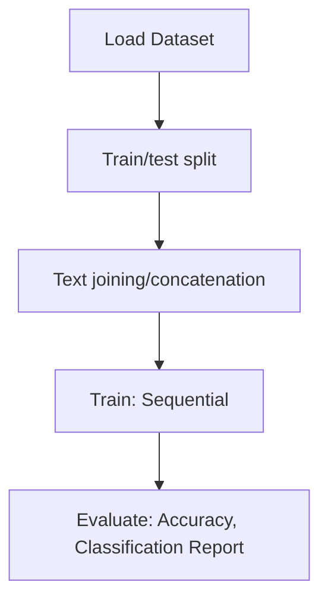

# Traffic_Sign_Recognition

## 1. Project Overview

This project implements a **Image Classification** pipeline for **Traffic_Sign_Recognition**.

| Property | Value |
|----------|-------|
| **ML Task** | Image Classification |
| **Dataset Status** | BLOCKED KAGGLE |

## 2. Dataset

> ⚠️ **Dataset not available locally.** kaggle: meowmeowmeowmeowmeow/gtsrb-german-traffic-sign

## 3. Pipeline Overview

### Original Notebook Pipeline

**Preprocessing:**
- Train/test split
- Text joining/concatenation

**Models trained:**
- Sequential

**Evaluation metrics:**
- Accuracy
- Classification Report
- Confusion Matrix
- Accuracy (Keras)
- Validation loss/accuracy
- Training loss tracking

## 4. ML Workflow



## 5. Notebook Summary

| Metric | Value |
|--------|-------|
| Total cells | 77 |
| Code cells | 76 |
| Markdown cells | 1 |
| Original models | Sequential |

## 6. Model Details

### Original Models

- `Sequential`

**Neural network architecture:**

```
  Dense(256)
  Dense(128)
  Dense(43)
  Flatten
```

### Evaluation Metrics

- Accuracy
- Classification Report
- Confusion Matrix
- Accuracy (Keras)
- Validation loss/accuracy
- Training loss tracking

## 7. Project Structure

```
Traffic_Sign_Recognition/
├── rgb_classifier_recognition.ipynb
└── README.md
```

## 8. Setup & Installation

`pip install -r requirements.txt` from the workspace root.

**Key dependencies:**

- `Pillow`
- `keras`
- `matplotlib`
- `numpy`
- `pandas`
- `scikit-learn`
- `seaborn`
- `tensorflow`

## 9. How to Run

Open and run the notebook(s) sequentially:

```bash
jupyter notebook
```

- Open `rgb_classifier_recognition.ipynb` and run all cells

## 10. Testing

Automated tests are available in `tests/test_p042_*.py`:

```bash
python -m pytest tests/test_p042_*.py -v
```

Tests validate data loading and model instantiation.

## 11. Limitations

- Dataset is not available locally — notebook cannot run without manual data setup
- Hardcoded file paths detected — may need adjustment
