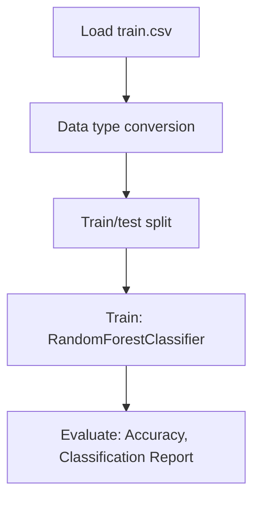

# Advanced Uses of SHAP Values

## 1. Project Overview

This project implements a **Classification** pipeline for **Advanced Uses of SHAP Values**.

| Property | Value |
|----------|-------|
| **ML Task** | Classification |
| **Dataset Status** | OK LOCAL |

## 2. Dataset

**Data sources detected in code:**

- `train.csv`

**Files in project directory:**

- `link_to_dataset.txt`
- `train.csv`

**Standardized data path:** `data/advanced_uses_of_shap_values/`

## 3. Pipeline Overview

### Original Notebook Pipeline

**Preprocessing:**
- Data type conversion
- Train/test split

**Models trained:**
- RandomForestClassifier

**Evaluation metrics:**
- Accuracy
- Classification Report
- Confusion Matrix

## 4. ML Workflow



## 5. Notebook Summary

| Metric | Value |
|--------|-------|
| Total cells | 17 |
| Code cells | 17 |
| Markdown cells | 0 |
| Original models | RandomForestClassifier |

## 6. Model Details

### Original Models

- `RandomForestClassifier`

### Evaluation Metrics

- Accuracy
- Classification Report
- Confusion Matrix

## 7. Project Structure

```
Advanced Uses of SHAP Values/
├── exercise-advanced-uses-of-shap-values(1).ipynb
├── link_to_dataset.txt
├── train.csv
└── README.md
```

## 8. Setup & Installation

`pip install -r requirements.txt` from the workspace root.

**Key dependencies:**

- `numpy`
- `pandas`
- `scikit-learn`

## 9. How to Run

Open and run the notebook(s) sequentially:

```bash
jupyter notebook
```

- Open `exercise-advanced-uses-of-shap-values(1).ipynb` and run all cells

## 10. Testing

Automated tests are available in `tests/test_p153_*.py`:

```bash
python -m pytest tests/test_p153_*.py -v
```

Tests validate data loading and model instantiation.

## 11. Limitations

No significant limitations detected.
